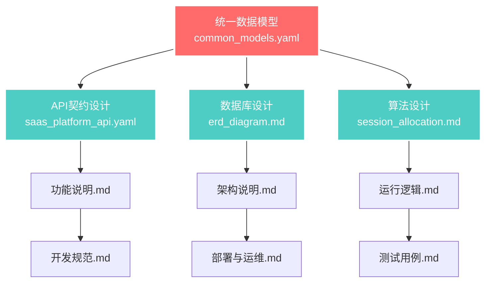

# 📚 AstrBot SaaS 平台 - 完整文档导航中心

> **文档体系版本**: v1.0 | **最后更新**: 2024年 | **维护团队**: AstrBot开发团队

## 🎯 快速导航

### 🚀 **新手入门路径**
1. [**项目概述**](./README.md) → [**功能说明**](./功能说明.md) → [**需求规格说明书**](./需求规格说明书.md)
2. [**架构说明**](./架构说明.md) → [**技术栈选择**](./3.技术栈.md) → [**改造方案评估**](./1.改造方案评估.md)
3. [**开发规范**](./开发规范.md) → [**测试用例**](./测试用例.md) → [**部署与运维**](./部署与运维.md)

### 👨‍💻 **开发者参考路径**  
1. [**API契约设计**](./api_contracts/README.md) → [**统一数据模型**](./api_contracts/models/common_models.yaml)
2. [**数据库设计**](./database_design/README.md) → [**实体关系图**](./database_design/erd_diagram.md)
3. [**算法设计**](./algorithms/README.md) → [**会话分配算法**](./algorithms/session_management/session_allocation.md)

### 🛠️ **运维人员参考路径**
1. [**部署与运维**](./部署与运维.md) → [**运行逻辑**](./运行逻辑（核心流程图）.md)
2. [**测试用例**](./测试用例.md) → [**开发规范**](./开发规范.md)

---

## 📋 完整文档目录

### 🎯 **1. 项目规划与分析** 
| 文档 | 状态 | 描述 | 关键内容 |
|------|------|------|----------|
| [**README.md**](./README.md) | ✅ 完成 | 项目总览和快速开始 | 项目介绍、安装指南、基本使用 |
| [**功能说明.md**](./功能说明.md) | ✅ 完成 | 业务功能详细说明 | 核心功能、业务流程、用例分析 |
| [**需求规格说明书.md**](./需求规格说明书.md) | ✅ 完成 | 详细需求规格定义 | 功能需求、非功能需求、约束条件 |
| [**1.改造方案评估.md**](./1.改造方案评估.md) | ✅ 完成 | AstrBot改造为SaaS的可行性分析 | 技术评估、架构改造、实施方案 |

### 🏗️ **2. 架构与设计**
| 文档 | 状态 | 描述 | 关键内容 |
|------|------|------|----------|
| [**架构说明.md**](./架构说明.md) | ✅ 完成 | 系统架构设计 | 技术架构、部署架构、安全架构 |
| [**3.技术栈.md**](./3.技术栈.md) | ✅ 完成 | 技术选型和说明 | 前后端技术栈、工具链选择 |
| [**运行逻辑（核心流程图）.md**](./运行逻辑（核心流程图）.md) | ✅ 完成 | 核心业务流程 | 业务时序图、状态机、流程图 |

### 📊 **3. 数据与API设计**
| 文档分类 | 文档 | 状态 | 描述 |
|----------|------|------|------|
| **API契约** | [**API契约目录**](./api_contracts/README.md) | ✅ 完成 | API设计规范和版本管理 |
| | [**统一数据模型**](./api_contracts/models/common_models.yaml) | ✅ 完成 | 🔗 **核心参考** - 全局数据一致性 |
| | [**SaaS平台API**](./api_contracts/saas_platform_api.yaml) | ✅ 完成 | OpenAPI 3.0规范的完整接口定义 |
| **数据库设计** | [**数据库设计概述**](./database_design/README.md) | ✅ 完成 | 数据库架构原则和设计理念 |
| | [**实体关系图**](./database_design/erd_diagram.md) | ✅ 完成 | 🔗 **核心参考** - 完整ERD图和表结构 |

### 🧠 **4. 算法与核心逻辑**  
| 文档分类 | 文档 | 状态 | 描述 |
|----------|------|------|------|
| **算法设计** | [**算法设计目录**](./algorithms/README.md) | ✅ 完成 | 算法分类和导航 |
| | [**算法设计概述**](./algorithms/00_algorithms_design_overview.md) | ✅ 完成 | 算法架构原则和设计指导 |
| | [**会话分配算法**](./algorithms/session_management/session_allocation.md) | ✅ 完成 | 🔗 **核心参考** - 智能分配完整实现 |

### 🔧 **5. 开发实现**
| 文档 | 状态 | 描述 | 关键内容 |
|------|------|------|----------|
| [**开发规范.md**](./开发规范.md) | ✅ 完成 | 代码规范和开发流程 | 编码标准、提交规范、分支策略 |

### 🧪 **6. 测试与质量**  
| 文档 | 状态 | 描述 | 关键内容 |
|------|------|------|----------|
| [**测试用例.md**](./测试用例.md) | ✅ 完成 | 完整测试计划和用例 | 单元测试、集成测试、E2E测试 |

### 🚀 **7. 部署与运维**
| 文档 | 状态 | 描述 | 关键内容 |
|------|------|------|----------|
| [**部署与运维.md**](./部署与运维.md) | ✅ 完成 | 生产环境部署指南 | 容器化部署、监控告警、备份策略 |

---

## 🔗 文档关联性矩阵

### 📊 **核心数据模型关联**


### 🎯 **业务逻辑关联**


---

## 🎯 文档使用指南

### 📖 **按角色推荐阅读顺序**

#### 👤 **产品经理 / 业务分析师**
1. [功能说明.md](./功能说明.md) - 了解业务需求
2. [需求规格说明书.md](./需求规格说明书.md) - 详细需求分析
3. [改造方案评估.md](./1.改造方案评估.md) - 可行性评估
4. [运行逻辑（核心流程图）.md](./运行逻辑（核心流程图）.md) - 业务流程

#### 🏗️ **架构师 / 技术负责人**
1. [架构说明.md](./架构说明.md) - 系统架构设计
2. [技术栈.md](./3.技术栈.md) - 技术选型依据
3. [统一数据模型](./api_contracts/models/common_models.yaml) - 数据架构
4. [算法设计概述](./algorithms/00_algorithms_design_overview.md) - 核心算法架构

#### 💻 **后端开发工程师**
1. [开发规范.md](./开发规范.md) - 开发标准
2. [API契约设计](./api_contracts/README.md) - 接口规范
3. [数据库设计](./database_design/README.md) - 数据存储
4. [算法设计](./algorithms/README.md) - 业务逻辑实现

#### 🎨 **前端开发工程师**  
1. [开发规范.md](./开发规范.md) - 前端标准
2. [API契约设计](./api_contracts/saas_platform_api.yaml) - 接口对接
3. [功能说明.md](./功能说明.md) - UI/UX需求

#### 🧪 **测试工程师**
1. [测试用例.md](./测试用例.md) - 测试计划和用例
2. [功能说明.md](./功能说明.md) - 测试需求
3. [API契约设计](./api_contracts/saas_platform_api.yaml) - 接口测试

#### 🛠️ **运维工程师 / DevOps**
1. [部署与运维.md](./部署与运维.md) - 运维指南  
2. [架构说明.md](./架构说明.md) - 部署架构
3. [技术栈.md](./3.技术栈.md) - 技术环境

---

## 🤖 AI协同优化指南

### 📝 **AI使用本文档的最佳实践**

#### 🔍 **1. 常见查询模式**
```bash
# 数据模型查询
"根据统一数据模型，SessionEntity有哪些字段？"
→ 参考: api_contracts/models/common_models.yaml

# 算法实现查询  
"会话分配算法的评分机制是什么？"
→ 参考: algorithms/session_management/session_allocation.md

# API接口查询
"创建会话的接口请求格式是什么？"
→ 参考: api_contracts/saas_platform_api.yaml

# 数据库查询
"tenants表和sessions表的关系是什么？"
→ 参考: database_design/erd_diagram.md
```

#### 🔗 **2. 文档交叉引用索引**
| 概念/实体 | 主要定义位置 | 相关文档 |
|-----------|-------------|----------|
| **TenantEntity** | `api_contracts/models/common_models.yaml` | `database_design/erd_diagram.md`, `api_contracts/saas_platform_api.yaml` |
| **SessionEntity** | `api_contracts/models/common_models.yaml` | `algorithms/session_management/session_allocation.md`, `功能说明.md` |
| **会话分配算法** | `algorithms/session_management/session_allocation.md` | `api_contracts/models/common_models.yaml`, `架构说明.md` |
| **黑名单同步** | `api_contracts/models/common_models.yaml` | `algorithms/00_algorithms_design_overview.md`, `功能说明.md` |
| **LLM配置** | `api_contracts/models/common_models.yaml` | `3.技术栈.md`, `架构说明.md` |

#### 🧠 **3. 智能问答提示**
```yaml
# 当AI需要回答关于数据结构的问题时
data_structure_questions:
  primary_source: "api_contracts/models/common_models.yaml"
  validation_sources: 
    - "database_design/erd_diagram.md"
    - "api_contracts/saas_platform_api.yaml"

# 当AI需要回答关于业务逻辑的问题时  
business_logic_questions:
  primary_source: "algorithms/"
  context_sources:
    - "功能说明.md"
    - "运行逻辑（核心流程图）.md"

# 当AI需要回答关于技术实现的问题时
technical_implementation_questions:
  primary_source: "架构说明.md"
  reference_sources:
    - "3.技术栈.md"
    - "开发规范.md"
    - "部署与运维.md"
```

---

## 📊 文档质量与维护

### ✅ **文档完成度统计**
- **总文档数**: 17个
- **已完成**: 17个 (100%)
- **核心设计文档**: 6个 (统一数据模型、API契约、数据库设计、算法设计、架构说明、功能说明)
- **支撑文档**: 11个

### 🔄 **文档版本控制策略** 
```bash
# 版本命名规范
v{major}.{minor}.{patch}

# 主要版本 (major): 架构重大变更
# 次要版本 (minor): 新功能添加
# 补丁版本 (patch): 错误修复和优化

当前版本: v1.0.0
```

### 📅 **维护计划**
| 文档类型 | 更新频率 | 责任人 | 触发条件 |
|----------|----------|--------|----------|
| **核心设计文档** | 需求驱动 | 架构师 | 架构变更、新功能 |
| **API契约** | 迭代更新 | 后端Lead | 接口变更 |
| **算法设计** | 需求驱动 | 算法工程师 | 算法优化 |  
| **开发规范** | 季度评审 | 技术Lead | 工具升级、最佳实践更新 |
| **部署运维** | 月度检查 | DevOps | 环境变更、工具升级 |

---

## 📞 联系和支持

### 👥 **文档维护团队**
- **总负责人**: 技术架构师
- **API文档**: 后端开发Leader  
- **算法文档**: 算法工程师
- **部署文档**: DevOps工程师

### 🐛 **问题反馈**
- **文档错误**: 提交Issue到项目仓库
- **内容更新**: 通过PR提交修改
- **新增需求**: 联系对应文档维护负责人

### 📚 **扩展阅读**
- [AstrBot官方文档](https://github.com/Soulter/AstrBot)
- [OpenAPI规范](https://swagger.io/specification/)
- [Mermaid图表语法](https://mermaid-js.github.io/mermaid/)

---

> **重要提示**: 本文档索引会随着项目发展持续更新。所有文档修改都应该同步更新此索引文件，确保导航的准确性和完整性。

**文档索引版本**: v1.0.0 | **创建日期**: 2024年 | **维护**: AstrBot开发团队 