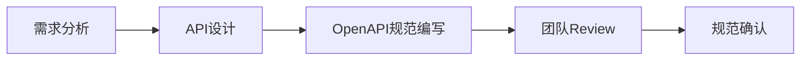
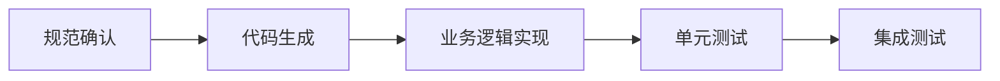

# 📡 API契约文档

## 📑 目录
- [1. 文档概述](#1-文档概述)
- [2. API分类说明](#2-api分类说明)
- [3. 使用指南](#3-使用指南)
- [4. 版本管理](#4-版本管理)

---

## 1. 文档概述

本目录包含AstrBot SaaS平台所有API接口的标准化契约文档，采用OpenAPI 3.0规范编写。这些文档为前后端开发、微服务集成和API测试提供精确的规格定义。

### 🎯 文档用途
- **前后端分离开发**: 提供统一的接口规范
- **微服务协作**: 定义服务间通信契约
- **自动化测试**: 生成测试用例和Mock服务
- **代码生成**: 自动生成客户端SDK和服务端代码骨架
- **API文档**: 生成交互式API文档

---

## 2. API分类说明

### 📋 API文档结构
```
api_contracts/
├── README.md                          # 本文档
├── saas_platform_api.yaml            # SaaS主平台API规范
├── astrbot_webhook_api.yaml           # AstrBot Webhook API规范
├── astrbot_management_api.yaml        # AstrBot管理API规范
├── internal_services_api.yaml         # 内部服务间API规范
└── models/                            # 数据模型定义
    ├── common_models.yaml             # 通用数据模型
    ├── tenant_models.yaml             # 租户相关模型
    ├── message_models.yaml            # 消息相关模型
    └── configuration_models.yaml      # 配置相关模型
```

### 🔧 API分类详情

| API文档 | 服务范围 | 主要功能 | 使用方 |
|---------|----------|----------|--------|
| **saas_platform_api.yaml** | SaaS主平台对外API | 租户管理、会话管理、消息查询 | 前端界面、第三方集成 |
| **astrbot_webhook_api.yaml** | AstrBot → SaaS平台 | 消息上报、状态同步 | AstrBot实例 |
| **astrbot_management_api.yaml** | SaaS平台 → AstrBot | 配置下发、指令控制 | SaaS平台管理服务 |
| **internal_services_api.yaml** | 微服务间通信 | 内部服务协作 | 微服务组件 |

---

## 3. 使用指南

### 🚀 快速开始

#### 查看API文档
```bash
# 使用Swagger UI查看API文档
docker run -p 8080:8080 -e SWAGGER_JSON=/api/saas_platform_api.yaml \
  -v $(pwd):/api swaggerapi/swagger-ui

# 访问 http://localhost:8080 查看交互式文档
```

#### 代码生成示例
```bash
# 生成Python客户端SDK
openapi-generator generate -i saas_platform_api.yaml \
  -g python -o ./sdk/python-client

# 生成TypeScript前端类型定义
openapi-generator generate -i saas_platform_api.yaml \
  -g typescript-axios -o ./sdk/typescript-client

# 生成Go服务端代码骨架
openapi-generator generate -i saas_platform_api.yaml \
  -g go-server -o ./server/go-generated
```

#### API测试
```bash
# 使用Newman运行API测试
npm install -g newman
newman run postman_collection.json -e production.json
```

### 📝 开发工作流

#### 1. API设计阶段


#### 2. 开发实施阶段


### 🔍 规范验证
```bash
# 验证OpenAPI规范格式
swagger-codegen validate -i saas_platform_api.yaml

# 使用spectral进行规范质量检查
spectral lint saas_platform_api.yaml
```

---

## 4. 版本管理

### 📋 版本策略
- **主版本(Major)**: 不兼容的API变更 (v1.0.0 → v2.0.0)
- **次版本(Minor)**: 向后兼容的功能新增 (v1.0.0 → v1.1.0)  
- **补丁版本(Patch)**: 向后兼容的问题修复 (v1.0.0 → v1.0.1)

### 🔄 变更管理
```yaml
# 版本信息示例
openapi: 3.0.3
info:
  title: SaaS Platform API
  version: 1.2.0
  description: |
    AstrBot SaaS平台主要API接口规范
    
    变更日志:
    - v1.2.0: 新增LLM配置管理接口
    - v1.1.0: 新增消息分析统计接口  
    - v1.0.0: 初始版本发布
```

### 📝 变更流程
1. **提出变更**: 创建API变更提案
2. **影响评估**: 评估对现有系统的影响
3. **版本规划**: 确定版本号和发布计划
4. **文档更新**: 更新OpenAPI规范和相关文档
5. **代码实现**: 实现API变更
6. **测试验证**: 执行回归测试
7. **发布部署**: 按计划发布新版本

---

**API契约文档版本**: v1.0  
**最后更新**: 2024年  
**维护责任人**: API团队 