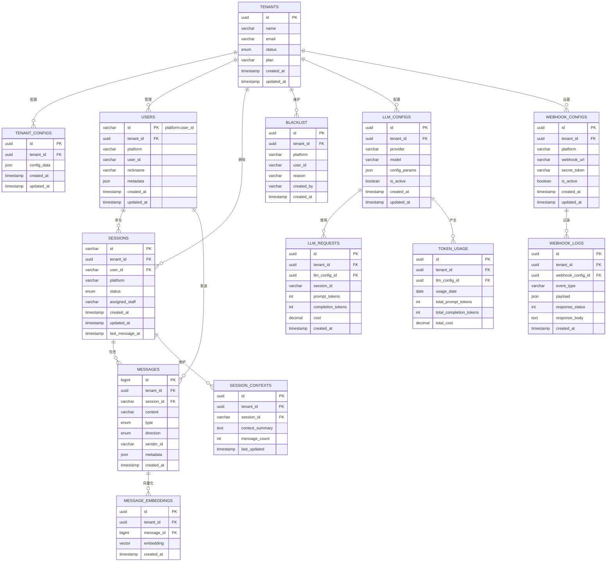
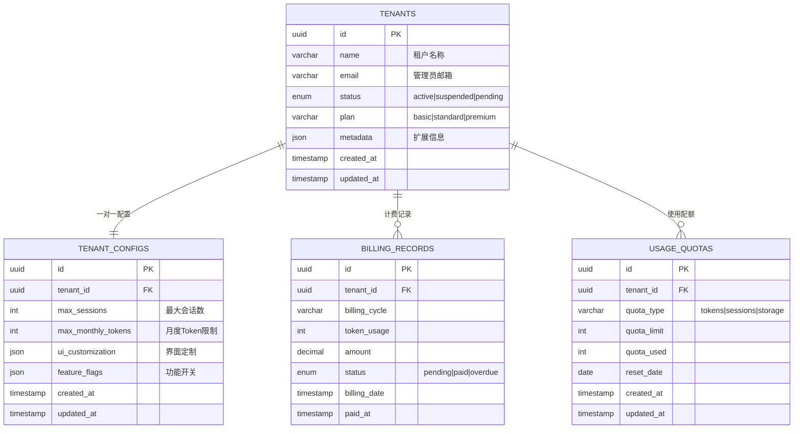
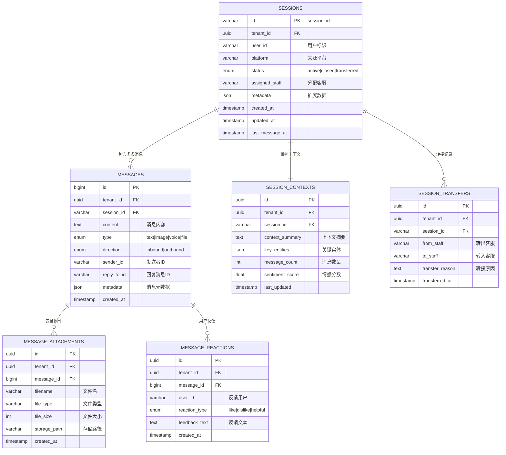
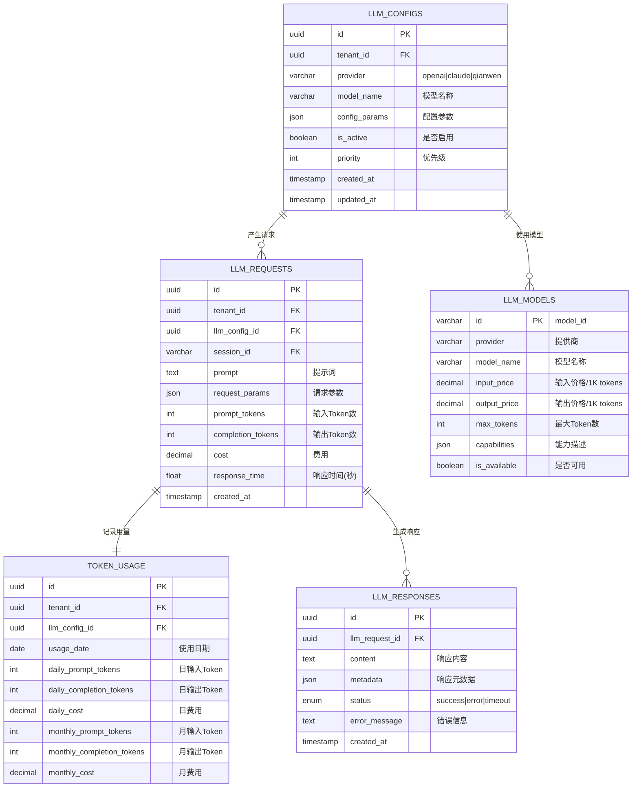

# 📊 实体关系图 (ERD)

## 📑 目录
- [1. 整体ERD图](#1-整体erd图)
- [2. 核心业务域关系](#2-核心业务域关系)
- [3. 表关系详解](#3-表关系详解)
- [4. 约束与索引说明](#4-约束与索引说明)

---

## 1. 整体ERD图

### 🏗️ 主要业务域关系图



---

## 2. 核心业务域关系

### 🏢 租户管理域



### 💬 消息会话域



### 🤖 LLM集成域



---

## 3. 表关系详解

### 🔗 主键与外键约束

#### 1. 租户隔离约束
```sql
-- 所有业务表都包含 tenant_id 外键
ALTER TABLE sessions 
ADD CONSTRAINT fk_sessions_tenant 
FOREIGN KEY (tenant_id) REFERENCES tenants(id) ON DELETE CASCADE;

-- 复合外键确保跨表查询的租户一致性
ALTER TABLE messages 
ADD CONSTRAINT fk_messages_session_tenant 
FOREIGN KEY (tenant_id, session_id) REFERENCES sessions(tenant_id, id);
```

#### 2. 级联删除策略
```sql
-- 租户删除时级联删除所有相关数据
CREATE TABLE sessions (
    id VARCHAR(255) PRIMARY KEY,
    tenant_id UUID NOT NULL REFERENCES tenants(id) ON DELETE CASCADE,
    -- 其他字段...
);

-- 会话删除时级联删除消息
CREATE TABLE messages (
    id BIGSERIAL PRIMARY KEY,
    session_id VARCHAR(255) NOT NULL REFERENCES sessions(id) ON DELETE CASCADE,
    -- 其他字段...
);
```

#### 3. 数据完整性约束
```sql
-- 枚举类型约束
CREATE TYPE tenant_status AS ENUM ('active', 'suspended', 'pending');
CREATE TYPE session_status AS ENUM ('active', 'closed', 'transferred');
CREATE TYPE message_type AS ENUM ('text', 'image', 'voice', 'file', 'system');

-- 检查约束
ALTER TABLE messages 
ADD CONSTRAINT chk_content_not_empty 
CHECK (LENGTH(content) > 0);

ALTER TABLE llm_requests 
ADD CONSTRAINT chk_tokens_positive 
CHECK (prompt_tokens >= 0 AND completion_tokens >= 0);
```

### 📊 索引策略说明

#### 1. 高频查询索引
```sql
-- 租户+时间范围查询
CREATE INDEX idx_messages_tenant_time 
ON messages (tenant_id, created_at DESC);

-- 会话消息查询
CREATE INDEX idx_messages_session_time 
ON messages (session_id, created_at DESC);

-- 用户会话查询
CREATE INDEX idx_sessions_user_status 
ON sessions (tenant_id, user_id, status);
```

#### 2. 复合索引设计
```sql
-- 支持多维度筛选的复合索引
CREATE INDEX idx_sessions_multi_filter 
ON sessions (tenant_id, platform, status, created_at DESC);

-- 覆盖索引减少回表查询
CREATE INDEX idx_messages_summary 
ON messages (session_id, created_at DESC) 
INCLUDE (content, type, sender_id);
```

#### 3. 部分索引优化
```sql
-- 只为活跃会话创建索引
CREATE INDEX idx_active_sessions 
ON sessions (tenant_id, last_message_at DESC) 
WHERE status = 'active';

-- 只为近期消息创建全文索引
CREATE INDEX idx_recent_message_content 
ON messages USING gin(to_tsvector('english', content))
WHERE created_at > CURRENT_DATE - INTERVAL '90 days';
```

---

## 4. 约束与索引说明

### ⚡ 性能优化索引

| 索引名称 | 表名 | 字段 | 用途 | 估算查询性能提升 |
|----------|------|------|------|------------------|
| `idx_messages_tenant_session_time` | messages | (tenant_id, session_id, created_at) | 会话消息查询 | 100x |
| `idx_sessions_tenant_user` | sessions | (tenant_id, user_id) | 用户会话查询 | 50x |
| `idx_llm_requests_tenant_date` | llm_requests | (tenant_id, created_at) | Token使用统计 | 20x |
| `idx_blacklist_tenant_platform_user` | blacklist | (tenant_id, platform, user_id) | 黑名单检查 | 200x |

### 🔒 数据完整性约束

#### 1. 业务逻辑约束
```sql
-- 确保会话状态转换的合理性
CREATE OR REPLACE FUNCTION validate_session_status_transition()
RETURNS TRIGGER AS $$
BEGIN
    -- 只能从 active 转为 closed 或 transferred
    IF OLD.status = 'active' AND NEW.status NOT IN ('closed', 'transferred') THEN
        RAISE EXCEPTION '无效的会话状态转换: % -> %', OLD.status, NEW.status;
    END IF;
    
    -- closed 状态不能再转换
    IF OLD.status = 'closed' AND NEW.status != 'closed' THEN
        RAISE EXCEPTION '已关闭的会话不能重新激活';
    END IF;
    
    RETURN NEW;
END;
$$ LANGUAGE plpgsql;

CREATE TRIGGER trg_session_status_validation
    BEFORE UPDATE ON sessions
    FOR EACH ROW
    EXECUTE FUNCTION validate_session_status_transition();
```

#### 2. 数据一致性约束
```sql
-- 确保消息的 tenant_id 与会话一致
CREATE OR REPLACE FUNCTION validate_message_tenant_consistency()
RETURNS TRIGGER AS $$
DECLARE
    session_tenant_id UUID;
BEGIN
    SELECT tenant_id INTO session_tenant_id 
    FROM sessions 
    WHERE id = NEW.session_id;
    
    IF session_tenant_id != NEW.tenant_id THEN
        RAISE EXCEPTION '消息的租户ID与会话不一致';
    END IF;
    
    RETURN NEW;
END;
$$ LANGUAGE plpgsql;

CREATE TRIGGER trg_message_tenant_consistency
    BEFORE INSERT ON messages
    FOR EACH ROW
    EXECUTE FUNCTION validate_message_tenant_consistency();
```

### 📈 分区表设计

#### 1. 消息表按时间分区
```sql
-- 主表定义
CREATE TABLE messages (
    id BIGSERIAL,
    tenant_id UUID NOT NULL,
    session_id VARCHAR(255) NOT NULL,
    content TEXT NOT NULL,
    created_at TIMESTAMP WITH TIME ZONE NOT NULL DEFAULT NOW(),
    -- 其他字段...
    PRIMARY KEY (id, created_at)
) PARTITION BY RANGE (created_at);

-- 自动创建月度分区的函数
CREATE OR REPLACE FUNCTION create_monthly_message_partition(target_date DATE)
RETURNS VOID AS $$
DECLARE
    partition_name TEXT;
    start_date DATE;
    end_date DATE;
BEGIN
    start_date := DATE_TRUNC('month', target_date);
    end_date := start_date + INTERVAL '1 month';
    partition_name := 'messages_' || TO_CHAR(start_date, 'YYYY_MM');
    
    EXECUTE format(
        'CREATE TABLE %I PARTITION OF messages
         FOR VALUES FROM (%L) TO (%L)',
        partition_name, start_date, end_date
    );
    
    -- 为分区表创建索引
    EXECUTE format(
        'CREATE INDEX %I ON %I (tenant_id, session_id, created_at DESC)',
        'idx_' || partition_name || '_tenant_session_time',
        partition_name
    );
END;
$$ LANGUAGE plpgsql;
```

#### 2. 自动分区维护
```sql
-- 定期创建新分区的任务
CREATE OR REPLACE FUNCTION maintain_message_partitions()
RETURNS VOID AS $$
DECLARE
    target_month DATE;
BEGIN
    -- 为未来3个月创建分区
    FOR i IN 0..2 LOOP
        target_month := DATE_TRUNC('month', CURRENT_DATE + (i || ' months')::INTERVAL);
        
        -- 检查分区是否已存在
        IF NOT EXISTS (
            SELECT 1 FROM pg_tables 
            WHERE tablename = 'messages_' || TO_CHAR(target_month, 'YYYY_MM')
        ) THEN
            PERFORM create_monthly_message_partition(target_month);
        END IF;
    END LOOP;
    
    -- 删除6个月前的旧分区（根据数据保留策略）
    -- 这里仅作示例，实际应根据业务需求调整
END;
$$ LANGUAGE plpgsql;

-- 创建定时任务（需要 pg_cron 扩展）
SELECT cron.schedule('maintain-partitions', '0 0 1 * *', 'SELECT maintain_message_partitions();');
```

---

**ERD文档版本**: v1.0  
**最后更新**: 2024年  
**维护责任人**: 数据库设计团队 