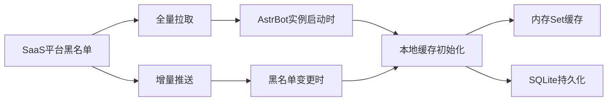
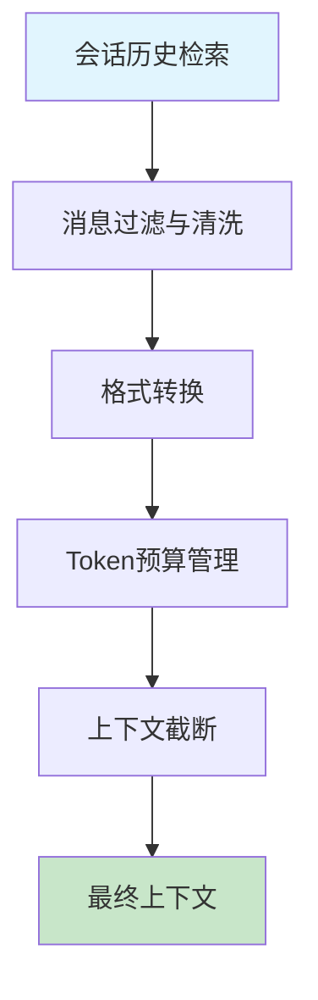

# 功能详细说明

## 📑 目录
- [3.1 多租户管理](#31-多租户管理)
- [3.2 会话与消息管理](#32-会话与消息管理)
- [3.3 黑名单机制](#33-黑名单机制)
- [3.4 语音转文字(ASR)](#34-语音转文字asr)
- [3.5 LLM推理与会话智能](#35-llm推理与会话智能)
- [3.6 数据统计与分析](#36-数据统计与分析)
- [3.7 系统配置与运维](#37-系统配置与运维)

---

## 3.1 多租户管理

### 3.1.1 租户注册与审批
- **注册流程**: SaaS平台提供租户注册入口，支持企业信息完善
- **审批机制**: 运营方手动审批或自动审批机制
- **信息管理**: 企业基本信息、联系人、业务规模等

### 3.1.2 资源隔离

#### 🏗️ 实例隔离
- **独立AstrBot实例**: 为每个租户自动调度和部署独立的AstrBot实例
- **编排工具**: 通过Kubernetes或类似编排工具实现
- **资源配额**: CPU、内存、存储等资源限制

#### 📊 数据隔离
- **数据库隔离**: 通过`tenant_id`严格隔离各租户数据
- **存储隔离**: 对象存储按租户目录分离
- **缓存隔离**: Redis缓存key带租户前缀

### 3.1.3 实例配置管理
| 配置类型 | 说明 | 管理方式 |
|---------|------|----------|
| **IM平台配置** | AppID/Secret等认证信息 | 加密存储，API安全传递 |
| **LLM配置** | API Key引用、模型参数 | 引用管理，动态更新 |
| **业务规则** | 黑名单、自动回复规则 | 实时同步，本地缓存 |

### 3.1.4 API密钥管理
- **密钥生成**: 为租户生成的API密钥，用于第三方系统集成
- **权限控制**: 细粒度的API访问权限控制
- **使用监控**: API调用次数、频率监控

---

## 3.2 会话与消息管理

### 3.2.1 会话生命周期管理

#### 🔄 会话状态
| 状态 | 描述 | 触发条件 |
|------|------|----------|
| **等待中** | 用户消息待处理 | 新消息到达，无客服在线 |
| **进行中** | 客服正在处理 | 客服接入会话 |
| **已结束** | 会话正常结束 | 客服主动结束或超时 |
| **转接中** | 转接给其他客服 | 客服发起转接操作 |

#### 📝 状态管理特性
- **统一管理**: 由SaaS主平台统一管理状态
- **实时同步**: 状态变更实时推送给相关客服
- **状态持久化**: 状态变更记录完整保存

### 3.2.2 消息存储系统

#### 💾 存储策略
- **主平台存储**: SaaS主平台数据库持久化所有会话消息
- **消息类型**: 
  - 用户消息（文本、语音、图片）
  - 客服消息（回复、系统操作）
  - 机器人消息（自动回复）
  - 系统消息（转接、结束等状态变更）
  - ASR转写结果
  - 被拦截的黑名单消息

#### 📁 消息格式支持
```json
{
  "message_types": [
    "text",      // 文本消息
    "image",     // 图片（可预览）
    "voice",     // 语音（可回听）
    "file",      // 文件（未来支持）
    "system"     // 系统消息
  ]
}
```

### 3.2.3 消息检索与追溯

#### 🔍 搜索功能
- **关键词搜索**: 全文搜索消息内容
- **用户筛选**: 按用户ID、昵称筛选
- **时间范围**: 灵活的时间区间查询
- **消息类型**: 按消息类型筛选
- **客服筛选**: 按处理客服筛选

#### 📈 检索性能优化
- **索引策略**: 针对常用搜索字段建立索引
- **分页查询**: 大数据量分页处理
- **缓存策略**: 热点查询结果缓存

### 3.2.4 会话上下文构建

#### 🧠 上下文管理
- **责任方**: SaaS主平台负责构建LLM所需的上下文
- **数据源**: 从历史消息中提取相关信息
- **格式转换**: 转换为LLM可理解的格式
- **截断策略**: 按Token数或消息条数截断
- **优先级**: 保留System Prompt和最新对话

---

## 3.3 黑名单机制

### 3.3.1 管理功能

#### 👥 黑名单管理界面
- **添加用户**: 支持按用户ID添加黑名单
- **平台区分**: 需区分不同IM平台的用户ID
- **批量操作**: 支持批量添加、删除
- **搜索查询**: 快速查找特定用户

#### 📝 详细信息管理
| 字段 | 说明 | 是否必填 |
|------|------|----------|
| **用户ID** | 平台唯一标识 | ✅ 必填 |
| **平台类型** | 企业微信/QQ等 | ✅ 必填 |
| **拦截原因** | 加入黑名单的原因 | ⚠️ 建议填写 |
| **有效期** | 黑名单过期时间 | ❌ 可选 |
| **操作人** | 添加操作的客服 | ✅ 自动记录 |
| **创建时间** | 添加时间 | ✅ 自动记录 |

### 3.3.2 同步机制

#### 🔄 数据同步策略


#### ⚡ 同步特性
- **启动同步**: AstrBot实例启动时全量拉取
- **实时同步**: SaaS平台变更后增量推送
- **重试机制**: 网络失败时自动重试
- **离线容错**: 本地SQLite持久化，离线时也能工作

### 3.3.3 执行与上报

#### 🛡️ 拦截执行
```python
# 拦截逻辑伪代码
async def check_blacklist(user_id: str, platform: str):
    # 1. 检查本地缓存
    if blacklist_cache.is_blocked(user_id, platform):
        # 2. 拦截消息
        await intercept_message()
        # 3. 上报拦截事件
        await webhook_reporter.report_blocked_message({
            "user_id": user_id,
            "platform": platform,
            "message_status": "blocked_by_blacklist",
            "timestamp": datetime.now()
        })
        return True
    return False
```

#### 📊 拦截统计
- **拦截计数**: 统计每个用户的拦截次数
- **拦截原因**: 记录详细的拦截原因
- **审计日志**: 完整的拦截操作审计

---

## 3.4 语音转文字(ASR)

### 3.4.1 语音接收与存储

#### 📁 文件处理流程
1. **语音接收**: AstrBot实例接收IM平台的语音消息
2. **文件上传**: 上传至SaaS平台统一管理的对象存储
3. **目录隔离**: 按租户目录进行隔离存储
4. **URL生成**: 生成带签名的限时访问URL
5. **安全控制**: 防止跨租户访问

#### 🔐 安全措施
- **访问控制**: 签名URL防止未授权访问
- **时效限制**: URL有效期控制
- **存储加密**: 语音文件加密存储

### 3.4.2 异步转写处理

#### 🎙️ ASR服务集成
```yaml
支持的ASR服务:
  内置:
    - Whisper: 开源语音识别模型
  外部:
    - Dify ASR API: 通过Dify平台调用
    - 百度语音识别: 商业ASR服务
    - 阿里云语音识别: 云厂商ASR服务
```

#### ⚡ 异步处理特性
- **非阻塞**: 不阻塞主消息处理流程
- **进度通知**: 可选的"语音处理中"事件上报
- **并发处理**: 支持多个语音文件同时转写

### 3.4.3 结果上报与处理

#### ✅ 成功结果
```json
{
  "asr_task_id": "unique_task_id",
  "status": "success",
  "result": {
    "text": "转写得到的文本内容",
    "confidence": 0.95,
    "language": "zh-CN",
    "duration": 15.2
  },
  "audio_url": "signed_url_to_original_audio",
  "timestamp": "2024-01-01T10:00:00Z"
}
```

#### ❌ 失败处理
```json
{
  "asr_task_id": "unique_task_id", 
  "status": "failed",
  "error": {
    "code": "ASR_TIMEOUT",
    "message": "语音识别超时"
  },
  "audio_url": "signed_url_to_original_audio",
  "timestamp": "2024-01-01T10:00:00Z"
}
```

### 3.4.4 失败处理与重试

#### 🔄 重试策略
- **自动重试**: 临时性错误（网络超时）自动重试1-2次
- **指数退避**: 重试间隔逐渐增加
- **失败记录**: SaaS平台记录ASR失败事件

#### 🛠️ 手动处理
- **失败提示**: 客服前端显示失败提示
- **音频回听**: 客服可点击URL回听原始语音
- **手动重试**: 未来支持手动触发重新识别

### 3.4.5 幂等性保障
- **任务ID**: 使用唯一的`asr_task_id`标识每个转写任务
- **重复检测**: 防止重复处理同一语音文件
- **状态追踪**: 完整的任务状态生命周期管理

---

## 3.5 LLM推理与会话智能

### 3.5.1 上下文管理

#### 🧠 上下文构建流程


#### 📊 上下文管理策略
| 策略 | 说明 | 优先级 |
|------|------|-------|
| **System Prompt保留** | 系统提示词始终保留 | 🔴 最高 |
| **最新对话优先** | 优先保留最近的对话 | 🟠 高 |
| **关键信息提取** | 提取用户关键需求信息 | 🟡 中 |
| **历史摘要** | 对较旧对话进行摘要 | 🟢 低 |

### 3.5.2 LLM调用代理

#### 🔗 代理调用架构
```
SaaS主平台 → AstrBot实例 → LLM服务提供商
     ↑              ↑              ↑
  上下文构建    代理转发        实际推理
```

#### 📡 API调用接口
```http
POST /astrbot-api/v1/llm/infer
Content-Type: application/json
Authorization: Bearer {token}

{
  "llm_config": {
    "provider": "dify",
    "model_id": "app_id_or_model_name",
    "auth": {
      "api_key": "encrypted_reference"
    }
  },
  "context": [
    {"role": "system", "content": "你是一个专业的客服助手"},
    {"role": "user", "content": "用户最新问题"},
    {"role": "assistant", "content": "之前的回复"}
  ],
  "inference_params": {
    "temperature": 0.7,
    "max_tokens": 1000,
    "stream": false
  },
  "user_id_for_llm": "user_123_for_tracking"
}
```

### 3.5.3 应用场景

#### 🤖 机器人自动回复
- **触发条件**: 
  - 客服离线时间段
  - 用户问题属于常见类型
  - 管理员配置的自动回复规则
- **处理流程**:
  1. SaaS平台判断需要机器人回复
  2. 构建包含历史对话的上下文
  3. 调用LLM生成回复
  4. 将回复存储并下发给用户

#### 📋 会话总结
- **触发时机**: 客服结束会话时
- **总结内容**:
  - 用户主要问题和需求
  - 问题解决方案
  - 客服处理效果评估
  - 后续跟进建议
- **存储位置**: 结果存入数据库，供后续查询和分析

#### 💡 客服话术推荐
- **实时推荐**: 根据当前对话实时生成建议回复
- **推荐类型**:
  - 标准话术模板
  - 个性化回复建议
  - 问题解决方案
  - 情感安抚话术
- **推送方式**: 通过WebSocket推送给客服前端

### 3.5.4 流式输出支持

#### 🚀 MVP阶段
- **实现方式**: 同步API（`stream=false`）
- **响应模式**: 一次性返回完整结果
- **优势**: 实现简单，稳定可靠

#### 🔮 后续迭代
- **流式支持**: LLM流式输出
- **技术改造**: 
  - AstrBot的LLM推理API支持SSE
  - SaaS平台的消息推送支持流式
- **用户体验**: 实时显示AI回复生成过程

### 3.5.5 Token用量记录

#### 📊 计量统计
```json
{
  "llm_usage": {
    "prompt_tokens": 150,
    "completion_tokens": 80,
    "total_tokens": 230,
    "model": "gpt-3.5-turbo",
    "cost": 0.0046
  }
}
```

#### 💰 成本分析
- **租户计费**: 按Token使用量计费
- **成本分摊**: 成本分摊到具体租户
- **使用优化**: 识别高Token使用场景，优化提示词

---

## 3.6 数据统计与分析

### 3.6.1 客户接待统计

#### 👥 客户数据分析
| 指标 | 计算方式 | 业务价值 |
|------|----------|----------|
| **总客户数** | 去重用户ID统计 | 了解客户规模 |
| **新访客数** | 首次会话用户统计 | 获客效果分析 |
| **老访客数** | 重复会话用户统计 | 客户忠诚度 |
| **一次性解决率** | 单次会话解决问题比例 | 服务质量指标 |

### 3.6.2 机器人接待统计

#### 🤖 机器人性能分析
- **机器人接待量**: 自动回复的消息数量
- **关键词触发**: 哪些关键词触发了自动回复
- **转人工次数**: 机器人无法处理转给人工的次数
- **解决率**: 机器人成功解决问题的比例

### 3.6.3 人工客服接待统计

#### 👨‍💼 客服工作量分析
```yaml
统计维度:
  接待量:
    - 人工接待总量
    - 有效接待量（排除测试消息）
    - 平均每日接待量
  
  响应效率:
    - 平均首次响应时长
    - 平均会话处理时长
    - 响应速度分布
  
  服务质量:
    - 客户满意度评分
    - 问题解决率
    - 客户投诉率
```

### 3.6.4 会话统计

#### 💬 会话维度分析
- **总会话量**: 所有会话的总数
- **有效会话量**: 排除测试和无效会话
- **平均会话时长**: 区分机器人处理和人工处理
- **会话分布**: 按时间段、渠道、客服分布

### 3.6.5 热门统计

#### 🔥 热点分析
- **热门词汇**: 用户消息中的高频词汇
- **热门问题**: 最常见的用户问题类型
- **热门时段**: 客服需求量最大的时间段
- **热门渠道**: 使用最多的IM平台

### 3.6.6 数据可视化

#### 📈 图表展示
- **趋势图**: 时间序列数据的趋势变化
- **饼图**: 比例分布数据
- **柱状图**: 分类数据对比
- **热力图**: 时间和渠道的交叉分析

#### 🔍 筛选功能
- **时间筛选**: 灵活的时间范围选择
- **客服筛选**: 按具体客服人员筛选
- **渠道筛选**: 按IM平台渠道筛选
- **租户筛选**: 多租户数据对比（运营后台）

### 3.6.7 性能优化

#### ⚡ 查询优化
- **数据源**: SaaS主平台数据库为主要数据源
- **OLAP优化**: 考虑数据仓库或OLAP优化复杂查询
- **缓存策略**: 热点统计数据缓存
- **异步计算**: 重计算任务异步处理

---

## 3.7 系统配置与运维

### 3.7.1 配置管理

#### ⚙️ 配置API
```http
# AstrBot实例拉取配置
GET /astrbot-api/v1/config
Authorization: Bearer {instance_token}

# SaaS平台推送配置
POST /astrbot-api/v1/config/update
Content-Type: application/json
{
  "config_type": "blacklist",
  "action": "add",
  "data": {...}
}
```

#### 🔄 热更新机制
- **配置监听**: AstrBot实例监听配置变更
- **增量更新**: 只推送变更的配置项
- **版本控制**: 配置版本管理，支持回滚
- **验证机制**: 配置合法性验证

### 3.7.2 实例健康检查

#### 💓 健康监控
```yaml
检查方式:
  K8s原生:
    - Liveness Probe: 检查实例是否存活
    - Readiness Probe: 检查实例是否就绪
    
  自定义检查:
    - Health Check API: /astrbot-api/v1/health
    - 业务功能检查: IM连接状态、数据库连接等
```

#### 🚨 故障处理
- **自动重启**: Kubernetes检测到不健康实例自动重启
- **流量切换**: 不健康实例暂停接收新请求
- **告警通知**: 实例故障及时告警给运维团队

### 3.7.3 系统监控

#### 📊 关键指标监控
```yaml
性能指标:
  - API延迟 (P50, P90, P99)
  - 错误率 (4xx, 5xx)
  - 吞吐量 (QPS/TPS)
  
资源指标:
  - CPU使用率
  - 内存使用率
  - 磁盘使用率
  - 网络IO
  
业务指标:
  - 消息处理延迟
  - 队列长度
  - 实例在线数量
  - 租户活跃度
```

#### 🔧 监控工具
- **Prometheus**: 指标采集和存储
- **Grafana**: 可视化展示和告警
- **AlertManager**: 告警规则和通知

### 3.7.4 日志聚合

#### 📝 日志收集
```yaml
日志来源:
  SaaS主平台:
    - 应用日志 (FastAPI access log)
    - 业务日志 (业务操作记录)
    - 错误日志 (异常和错误)
    
  AstrBot实例:
    - 实例运行日志
    - 消息处理日志
    - 外部服务调用日志
```

#### 🔍 日志系统
- **收集**: Fluentd/Filebeat从K8s节点收集
- **存储**: Elasticsearch集中存储
- **查询**: Kibana提供查询界面
- **分析**: 日志聚合分析和异常检测

### 3.7.5 升级与灰度

#### 🚀 部署策略
```yaml
升级方式:
  滚动升级:
    - K8s默认策略
    - 逐步替换旧版本Pod
    - 保障服务不中断
    
  蓝绿部署:
    - 部署完全相同的新环境
    - 测试通过后切换流量
    - 问题时快速回滚
    
  金丝雀发布:
    - 少量用户验证新版本
    - 逐步扩大用户范围
    - 风险可控的渐进式升级
```

#### 🎯 灰度能力
- **租户分组**: 支持租户分组进行灰度
- **流量分割**: 按比例分配新旧版本流量
- **实时监控**: 灰度过程中的实时监控
- **快速回滚**: 发现问题时快速回滚

---

## 📋 功能特性总结

### ✅ 核心优势
- **完整性**: 覆盖客服系统的所有核心功能
- **智能化**: 深度集成LLM提供智能化功能
- **可扩展**: 模块化设计支持功能扩展
- **可靠性**: 完善的监控和运维体系

### ✅ 技术亮点
- **异步处理**: 语音转写等耗时操作异步处理
- **实时推送**: WebSocket实现实时消息推送
- **数据一致性**: 完善的数据同步和缓存机制
- **性能优化**: 多级缓存和数据库优化

---

**功能版本**: v1.0  
**最后更新**: 2024年  
**下一步**: API接口设计和数据库表结构设计