# 开发规范文档

## 📑 目录
- [1. 版本控制规范](#1-版本控制规范)
- [2. 代码提交规范](#2-代码提交规范)
- [3. 测试规范](#3-测试规范)
- [4. 代码审查规范](#4-代码审查规范)
- [5. 安全编码规范](#5-安全编码规范)
- [6. 多租户开发规范](#6-多租户开发规范)
- [7. API开发规范](#7-api开发规范)
- [8. 文档同步规范](#8-文档同步规范)

---

## 1. 版本控制规范

### 1.1 分支管理策略

#### 🌳 GitFlow 工作流
我们采用 **GitFlow** 分支模型，确保代码管理的标准化和发布的可控性。

| 分支类型 | 分支名称 | 作用 | 创建来源 | 合并目标 |
|---------|----------|------|----------|----------|
| **主分支** | `main` | 生产环境代码 | - | - |
| **开发分支** | `develop` | 开发集成分支 | `main` | `main` |
| **功能分支** | `feature/功能名` | 新功能开发 | `develop` | `develop` |
| **发布分支** | `release/v1.0.0` | 预发布测试 | `develop` | `main` & `develop` |
| **修复分支** | `hotfix/问题描述` | 紧急修复 | `main` | `main` & `develop` |

#### 📋 分支命名规范
```bash
# 功能分支
feature/user-login           # 用户登录功能
feature/message-encryption   # 消息加密功能
feature/llm-integration     # LLM集成功能

# 发布分支
release/v1.0.0              # 1.0.0版本发布
release/v1.1.0-beta         # 1.1.0测试版

# 修复分支
hotfix/security-patch       # 安全补丁
hotfix/database-connection   # 数据库连接修复
```

### 1.2 分支保护规则

#### 🔒 保护策略
```yaml
main分支保护:
  - 禁止直接推送
  - 必须通过PR合并
  - 要求至少1个审批
  - 必须通过CI/CD检查
  - 要求分支为最新状态

develop分支保护:
  - 禁止直接推送
  - 必须通过PR合并
  - 要求通过基本CI检查
```

---

## 2. 代码提交规范

### 2.1 Conventional Commits 规范

#### 📝 提交消息格式
```
<type>[optional scope]: <description>

[optional body]

[optional footer(s)]
```

#### 🏷️ 提交类型说明
| 类型 | 说明 | 示例 |
|------|------|------|
| **feat** | 新增功能 | `feat(auth): add user login endpoint` |
| **fix** | 修复Bug | `fix(database): resolve N+1 query in session list` |
| **docs** | 文档更新 | `docs(api): update authentication documentation` |
| **style** | 代码格式调整 | `style: fix indentation in user service` |
| **refactor** | 代码重构 | `refactor(llm): extract context builder` |
| **test** | 测试相关 | `test(auth): add unit tests for login service` |
| **chore** | 构建配置等 | `chore: update dependencies` |
| **perf** | 性能优化 | `perf(query): optimize message search query` |

#### ✅ 良好提交示例
```bash
feat(tenant): add multi-tenant data isolation

- Implement tenant_id filtering in all database queries
- Add tenant context middleware for API requests
- Update user authentication to include tenant validation

Closes #123
```

#### ❌ 不良提交示例
```bash
fix bug          # 过于简单
update code      # 没有具体信息
WIP             # 工作进行中的提交不应合并
```

### 2.2 提交最佳实践

#### 📏 提交粒度
- **小而频繁**: 每次提交只包含一个逻辑变更
- **独立完整**: 每次提交都应该是可构建、可测试的
- **原子性**: 相关的文件修改应该在同一次提交中

#### 🔍 提交前检查清单
- [ ] 代码已通过本地测试
- [ ] 代码格式符合项目规范
- [ ] 提交消息符合 Conventional Commits 规范
- [ ] 敏感信息已移除
- [ ] 相关文档已更新

---

## 3. 测试规范

### 3.1 测试金字塔

#### 🏗️ 测试层次结构
```
        /\
       /  \
      / UI \
     /______\
    /        \
   /   集成   \
  /    测试    \
 /______________\
/                \
/     单元测试    \
/__________________\
```

### 3.2 单元测试规范

#### 🎯 测试覆盖要求
| 组件类型 | 覆盖率要求 | 重点测试内容 |
|---------|------------|--------------|
| **业务逻辑** | > 90% | 核心业务逻辑、边界条件 |
| **工具函数** | > 95% | 所有分支、异常情况 |
| **API控制器** | > 80% | 请求验证、响应格式 |
| **数据模型** | > 85% | 数据验证、关联关系 |

#### 🧪 单元测试示例 (Python)
```python
# tests/test_tenant_service.py
import pytest
from unittest.mock import Mock, patch
from app.services.tenant_service import TenantService
from app.exceptions import TenantNotFoundError

class TestTenantService:
    @pytest.fixture
    def tenant_service(self):
        return TenantService()
    
    def test_get_tenant_by_id_success(self, tenant_service):
        """测试通过ID获取租户 - 成功场景"""
        # Arrange
        tenant_id = "tenant_123"
        expected_tenant = {"id": tenant_id, "name": "Test Tenant"}
        
        with patch.object(tenant_service.db, 'get_tenant') as mock_get:
            mock_get.return_value = expected_tenant
            
            # Act
            result = tenant_service.get_tenant_by_id(tenant_id)
            
            # Assert
            assert result == expected_tenant
            mock_get.assert_called_once_with(tenant_id)
    
    def test_get_tenant_by_id_not_found(self, tenant_service):
        """测试通过ID获取租户 - 未找到场景"""
        # Arrange
        tenant_id = "nonexistent_tenant"
        
        with patch.object(tenant_service.db, 'get_tenant') as mock_get:
            mock_get.return_value = None
            
            # Act & Assert
            with pytest.raises(TenantNotFoundError):
                tenant_service.get_tenant_by_id(tenant_id)
```

#### 🧪 单元测试示例 (TypeScript)
```typescript
// tests/components/MessageList.test.ts
import { describe, it, expect, beforeEach } from 'vitest'
import { mount } from '@vue/test-utils'
import MessageList from '@/components/MessageList.vue'
import type { Message } from '@/types'

describe('MessageList', () => {
  let wrapper: VueWrapper<any>
  const mockMessages: Message[] = [
    {
      id: '1',
      content: 'Hello world',
      type: 'text',
      sender: 'user',
      timestamp: '2024-01-01T10:00:00Z'
    }
  ]

  beforeEach(() => {
    wrapper = mount(MessageList, {
      props: {
        messages: mockMessages
      }
    })
  })

  it('renders message list correctly', () => {
    expect(wrapper.find('.message-list').exists()).toBe(true)
    expect(wrapper.findAll('.message-item')).toHaveLength(1)
  })

  it('displays message content', () => {
    const messageContent = wrapper.find('.message-content')
    expect(messageContent.text()).toBe('Hello world')
  })

  it('emits message-click event when message is clicked', async () => {
    await wrapper.find('.message-item').trigger('click')
    expect(wrapper.emitted('message-click')).toHaveLength(1)
    expect(wrapper.emitted('message-click')?.[0]).toEqual(['1'])
  })
})
```

### 3.3 集成测试规范

#### 🔗 API契约测试
```python
# tests/integration/test_message_api.py
import pytest
import json
from fastapi.testclient import TestClient
from app.main import app

client = TestClient(app)

class TestMessageAPI:
    def test_post_message_success(self):
        """测试发送消息API - 成功场景"""
        # Arrange
        payload = {
            "content": "Hello, World!",
            "type": "text",
            "session_id": "session_123"
        }
        headers = {"Authorization": "Bearer valid_token"}
        
        # Act
        response = client.post("/api/v1/messages", 
                             json=payload, 
                             headers=headers)
        
        # Assert
        assert response.status_code == 201
        response_data = response.json()
        assert response_data["content"] == payload["content"]
        assert "id" in response_data
        assert "timestamp" in response_data

    def test_post_message_unauthorized(self):
        """测试发送消息API - 未授权场景"""
        payload = {"content": "Hello", "type": "text"}
        
        response = client.post("/api/v1/messages", json=payload)
        
        assert response.status_code == 401
        assert "Unauthorized" in response.json()["detail"]
```

### 3.4 端到端测试规范

#### 🎭 E2E测试示例 (Playwright)
```typescript
// tests/e2e/customer-service.spec.ts
import { test, expect } from '@playwright/test'

test.describe('客服工作台', () => {
  test.beforeEach(async ({ page }) => {
    await page.goto('/login')
    await page.fill('[data-testid="username"]', 'staff@example.com')
    await page.fill('[data-testid="password"]', 'password123')
    await page.click('[data-testid="login-button"]')
    await expect(page).toHaveURL('/dashboard')
  })

  test('接收并回复客户消息', async ({ page }) => {
    // 等待新消息通知
    await expect(page.locator('[data-testid="message-notification"]')).toBeVisible()
    
    // 点击会话
    await page.click('[data-testid="session-item"]:first-child')
    
    // 验证消息显示
    await expect(page.locator('[data-testid="message-content"]')).toContainText('用户问题')
    
    // 回复消息
    await page.fill('[data-testid="reply-input"]', '感谢您的咨询，我来为您解答')
    await page.click('[data-testid="send-button"]')
    
    // 验证回复发送成功
    await expect(page.locator('[data-testid="message-sent"]')).toBeVisible()
  })
})
```

---

## 4. 代码审查规范

### 4.1 审查流程

#### 🔄 PR/MR 工作流程

```mermaid
graph TD
    A[创建PR] --> B[CI/CD检查]
    B --> C{检查通过?}
    C -->|否| D[修复问题]
    D --> B
    C -->|是| E[指定审查者]
    E --> F[代码审查]
    F --> G{审查通过?}
    G -->|否| H[修改代码]
    H --> F
    G -->|是| I[合并代码]
    I --> J[删除分支]
```


### 4.2 审查清单

#### ✅ 代码质量检查
```yaml
功能正确性:
  - [ ] 代码实现了需求规格说明中的功能
  - [ ] 处理了所有边界条件和异常情况
  - [ ] 没有引入新的Bug

代码设计:
  - [ ] 遵循SOLID原则
  - [ ] 合理的抽象和封装
  - [ ] 没有重复代码
  - [ ] 函数/类职责单一

性能考虑:
  - [ ] 没有明显的性能问题
  - [ ] 数据库查询已优化
  - [ ] 没有不必要的循环嵌套

安全性:
  - [ ] 输入验证充分
  - [ ] 没有硬编码敏感信息
  - [ ] 权限检查正确
  - [ ] 多租户隔离有效
```

#### 📝 审查评论规范
```markdown
# 好的审查评论示例

## 建议改进
这里的数据库查询可能存在N+1问题，建议使用join来优化：
```python
# 当前实现
sessions = Session.all()
for session in sessions:
    print(session.user.name)  # 每次都查询数据库

# 建议优化
sessions = Session.select_related('user').all()
for session in sessions:
    print(session.user.name)  # 一次查询获取所有数据
```

## 安全问题
这里缺少租户ID验证，可能导致跨租户数据访问：
```python
# 当前实现
message = Message.objects.get(id=message_id)

# 建议修复
message = Message.objects.get(id=message_id, tenant_id=current_tenant.id)
```
```

---

## 5. 安全编码规范

### 5.1 OWASP Top 10 防护

#### 🛡️ 安全编码检查清单
| 安全风险 | 防护措施 | 代码示例 |
|---------|----------|----------|
| **SQL注入** | 使用参数化查询 | `SELECT * FROM users WHERE id = %s` |
| **XSS攻击** | 输出转义 | `escape(user_input)` |
| **CSRF攻击** | CSRF Token验证 | `@csrf_protect` |
| **认证绕过** | 严格权限检查 | `@require_authentication` |

#### 🔐 敏感信息处理
```python
# ❌ 错误做法 - 硬编码敏感信息
DATABASE_PASSWORD = "admin123"
API_KEY = "sk-1234567890abcdef"

# ✅ 正确做法 - 使用环境变量
import os
DATABASE_PASSWORD = os.getenv("DATABASE_PASSWORD")
API_KEY = os.getenv("OPENAI_API_KEY")

# ✅ 更好的做法 - 使用配置管理
from app.config import settings
DATABASE_PASSWORD = settings.database_password
API_KEY = settings.llm_api_key
```

### 5.2 输入验证规范

#### 📝 数据验证示例
```python
# 使用Pydantic进行严格的数据验证
from pydantic import BaseModel, validator
from typing import Optional

class MessageCreateRequest(BaseModel):
    content: str
    message_type: str
    session_id: str
    
    @validator('content')
    def validate_content(cls, v):
        if not v or len(v.strip()) == 0:
            raise ValueError('消息内容不能为空')
        if len(v) > 10000:
            raise ValueError('消息内容过长')
        return v.strip()
    
    @validator('message_type')
    def validate_message_type(cls, v):
        allowed_types = ['text', 'image', 'voice', 'file']
        if v not in allowed_types:
            raise ValueError(f'不支持的消息类型: {v}')
        return v

# API端点使用验证
@app.post("/api/v1/messages")
async def create_message(request: MessageCreateRequest):
    # Pydantic自动验证请求数据
    pass
```

---

## 6. 多租户开发规范

### 6.1 数据隔离原则

#### 🏢 租户上下文管理
```python
# 租户中间件示例
from starlette.middleware.base import BaseHTTPMiddleware
from app.context import set_current_tenant

class TenantMiddleware(BaseHTTPMiddleware):
    async def dispatch(self, request, call_next):
        # 从JWT token中提取租户ID
        tenant_id = extract_tenant_from_token(request)
        
        # 设置当前租户上下文
        set_current_tenant(tenant_id)
        
        try:
            response = await call_next(request)
            return response
        finally:
            # 清理租户上下文
            set_current_tenant(None)
```

#### 📊 数据库查询规范
```python
# ❌ 错误做法 - 没有租户过滤
def get_user_messages(user_id: str):
    return db.query(Message).filter(Message.user_id == user_id).all()

# ✅ 正确做法 - 包含租户过滤
def get_user_messages(user_id: str, tenant_id: str):
    return db.query(Message).filter(
        Message.user_id == user_id,
        Message.tenant_id == tenant_id
    ).all()

# ✅ 更好的做法 - 使用租户上下文
from app.context import get_current_tenant

def get_user_messages(user_id: str):
    tenant_id = get_current_tenant().id
    return db.query(Message).filter(
        Message.user_id == user_id,
        Message.tenant_id == tenant_id
    ).all()
```

### 6.2 API安全规范

#### 🔒 权限控制装饰器
```python
from functools import wraps
from app.exceptions import PermissionDeniedError

def require_tenant_access(func):
    """确保用户只能访问自己租户的资源"""
    @wraps(func)
    async def wrapper(*args, **kwargs):
        current_user = get_current_user()
        resource_tenant_id = kwargs.get('tenant_id')
        
        if current_user.tenant_id != resource_tenant_id:
            raise PermissionDeniedError("无权访问其他租户资源")
        
        return await func(*args, **kwargs)
    return wrapper

# 使用示例
@app.get("/api/v1/tenants/{tenant_id}/messages")
@require_tenant_access
async def get_tenant_messages(tenant_id: str):
    return get_messages_by_tenant(tenant_id)
```

---

## 7. API开发规范

### 7.1 RESTful API设计

#### 🌐 URL设计规范
```
# 资源命名使用复数名词
GET    /api/v1/messages          # 获取消息列表
POST   /api/v1/messages          # 创建新消息
GET    /api/v1/messages/{id}     # 获取特定消息
PUT    /api/v1/messages/{id}     # 更新特定消息
DELETE /api/v1/messages/{id}     # 删除特定消息

# 嵌套资源
GET    /api/v1/sessions/{id}/messages    # 获取会话的消息
POST   /api/v1/sessions/{id}/messages    # 在会话中创建消息
```

#### 📋 HTTP状态码规范
| 状态码 | 使用场景 | 示例 |
|--------|----------|------|
| **200** | 成功返回数据 | GET请求成功 |
| **201** | 成功创建资源 | POST创建成功 |
| **204** | 成功无返回内容 | DELETE成功 |
| **400** | 请求参数错误 | 验证失败 |
| **401** | 未认证 | 缺少或无效token |
| **403** | 无权限 | 跨租户访问 |
| **404** | 资源不存在 | ID不存在 |
| **500** | 服务器错误 | 系统异常 |

#### 📝 响应格式规范
```json
// 成功响应
{
  "success": true,
  "data": {
    "id": "msg_123",
    "content": "Hello world",
    "timestamp": "2024-01-01T10:00:00Z"
  },
  "meta": {
    "total": 100,
    "page": 1,
    "per_page": 20
  }
}

// 错误响应
{
  "success": false,
  "error": {
    "code": "VALIDATION_ERROR",
    "message": "请求参数验证失败",
    "details": {
      "content": ["消息内容不能为空"]
    }
  },
  "request_id": "req_123456"
}
```

### 7.2 API文档规范

#### 📖 OpenAPI规范示例
```python
from pydantic import BaseModel
from fastapi import FastAPI, HTTPException

app = FastAPI(
    title="AstrBot SaaS API",
    description="智能客服SaaS平台API文档",
    version="1.0.0"
)

class MessageResponse(BaseModel):
    """消息响应模型"""
    id: str
    content: str
    type: str
    timestamp: str
    
    class Config:
        schema_extra = {
            "example": {
                "id": "msg_123",
                "content": "Hello world",
                "type": "text",
                "timestamp": "2024-01-01T10:00:00Z"
            }
        }

@app.get(
    "/api/v1/messages/{message_id}",
    response_model=MessageResponse,
    summary="获取消息详情",
    description="根据消息ID获取消息的详细信息",
    responses={
        200: {"description": "成功返回消息信息"},
        404: {"description": "消息不存在"},
        403: {"description": "无权限访问该消息"}
    }
)
async def get_message(message_id: str):
    """
    获取指定ID的消息详情
    
    Args:
        message_id: 消息的唯一标识符
        
    Returns:
        MessageResponse: 消息详细信息
        
    Raises:
        HTTPException: 当消息不存在或无权限时
    """
    pass
```

---

## 8. 文档同步规范

### 8.1 文档更新要求

#### 📚 必须更新的文档
```yaml
API变更时:
  - OpenAPI规范文档
  - API使用示例
  - 错误码说明
  - 认证方式说明

数据库变更时:
  - 数据库表结构文档
  - 数据字典
  - 迁移脚本说明

配置变更时:
  - 部署文档
  - 环境变量说明
  - 配置项说明

功能变更时:
  - 用户手册
  - 功能说明文档
  - 测试用例文档
```

### 8.2 文档质量标准

#### ✅ 文档检查清单
- [ ] 文档内容准确无误
- [ ] 代码示例可以运行
- [ ] 包含完整的输入输出示例
- [ ] 错误处理场景有说明
- [ ] 版本信息已更新
- [ ] 链接地址有效

---

## 📋 开发规范总结

### ✅ 核心原则
- **安全第一**: 所有代码都要经过安全检查
- **质量保证**: 通过测试和代码审查确保质量
- **文档同步**: 代码变更必须同步更新文档
- **多租户意识**: 时刻注意数据隔离和权限控制

### ✅ 执行保障
- **自动化检查**: CI/CD流水线自动执行规范检查
- **强制审查**: 所有代码必须经过审查才能合并
- **定期回顾**: 定期回顾和更新开发规范
- **培训体系**: 新成员必须接受规范培训

---

**规范版本**: v1.0  
**最后更新**: 2024年  
**下一步**: 团队培训和规范落地执行