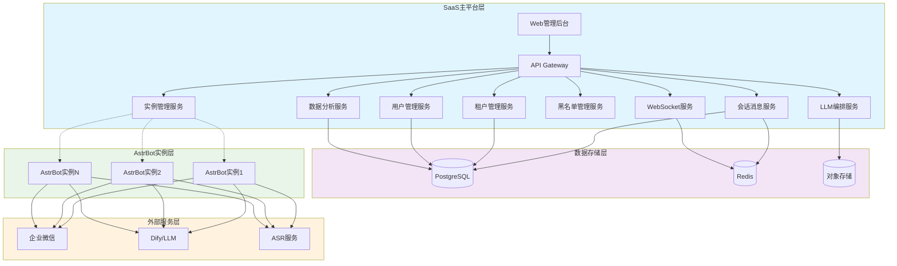

# 系统架构说明

## 📑 目录
- [1. 整体架构概览](#1-整体架构概览)
- [2. 核心架构图](#2-核心架构图)
- [3. 关键设计原则](#3-关键设计原则)
- [4. 组件详细说明](#4-组件详细说明)
- [5. 通信机制](#5-通信机制)
- [6. 数据流向](#6-数据流向)

---

## 1. 整体架构概览

AstrBot SaaS平台采用**微服务架构**，将系统分为两个主要层次：
- **SaaS主平台**：中心化控制和管理
- **AstrBot实例集群**：分布式执行单元

### 1.1 架构特点
- 🏗️ **微服务架构**：模块化设计，便于扩展和维护
- 🔄 **事件驱动**：基于事件的异步通信机制
- 🌐 **多租户支持**：完整的租户隔离和资源管理
- ☁️ **云原生**：基于Kubernetes的容器化部署

---

## 2. 核心架构图

### 2.1 系统架构图

```
+-----------------------------------------------------+
|                     SaaS主平台                      |
| (Python/FastAPI, Vue3, PostgreSQL, Redis)         |
|-----------------------------------------------------|
| - Web管理后台 (租户/客服/运营)                     |
| - RESTful API Gateway (对内/对外)                 |
| - 多租户管理 & 认证授权 (Tenant Service)            |
| - 会话与消息管理 (Session & Message Service)        |
| - 用户管理 (User Service)                           |
| - 数据库 (PostgreSQL: 租户数据, 会话历史等)          |
| - 缓存 (Redis: 会话上下文片段, 热点数据)            |
| - LLM编排与上下文构建服务 (LLM Orchestration)     |
| - ASR/外部服务配置管理 (Integration Service)        |
| - 黑名单管理服务 (Blacklist Service)                |
| - 数据统计与分析服务 (Analytics Service)            |
| - WebSocket服务 (实时消息推送至客服前端)            |
| - 实例调度与配置服务 (Instance Management Service)  |
+--------------------^--^--^------------------------+
                     |  |  | API 调用 (HTTPS, Token Auth)
                     |  |  | (配置, 指令下发)
                     |  |  +--------------------------------+
                     |  +---------------------+            | Webhook (HTTPS)
                     |                        |            | (消息/事件上报)
                     v                        v            v
+--------------------------------+  +--------------------------------+
|  AstrBot实例 1 (租户A)         |  |  AstrBot实例 N (租户X)         |
|  (Docker/K8s, Python/AstrBot)  |  |  (Docker/K8s, Python/AstrBot)  |
|--------------------------------|  |--------------------------------|
| - IM平台消息适配器 (企微等)    |  | - IM平台消息适配器 (企微等)    |
| - Webhook上报模块              |  | - Webhook上报模块              |
| - 消息下发API模块              |  | - 消息下发API模块              |
| - 配置接收与应用模块           |  | - 配置接收与应用模块           |
| - 本地黑名单缓存 (+持久化)     |  | - 本地黑名单缓存 (+持久化)     |
| - ASR执行模块 (调用ASR服务)    |  | - ASR执行模块 (调用ASR服务)    |
| - LLM推理代理API模块           |  | - LLM推理代理API模块                |
| - 语音文件处理 (上传对象存储)  |  | - 语音文件处理 (上传对象存储)  |
+--------------^-----------------+  +--------------^-----------------+
               |                                                            |
               | <--- IM平台消息/外部服务调用 ---> |
               +----------------------------------+
                     (企业微信, Dify, 对象存储等)
```

### 2.2 组件关系图



---

## 3. 关键设计原则

### 3.1 SaaS主平台中心化控制
- **业务逻辑集中**：所有核心业务逻辑在SaaS主平台实现
- **数据统一存储**：用户数据、会话历史、配置信息统一管理
- **状态统一管理**：会话状态、用户状态由主平台维护
- **用户界面统一**：所有用户交互通过主平台Web界面

### 3.2 AstrBot实例无状态化/易重建
- **执行单元定位**：AstrBot实例作为消息处理和外部服务调用的执行单元
- **无状态设计**：不持久化核心业务状态，便于快速重建
- **配置外部化**：所有配置通过主平台动态获取
- **易于伸缩**：支持根据负载动态创建/销毁实例

### 3.3 API驱动通信
- **标准化接口**：所有组件间通信通过定义良好的API
- **异步通信**：采用Webhook机制实现异步事件通知
- **认证授权**：统一的Token-based认证机制
- **版本控制**：API版本管理支持平滑升级

### 3.4 独立实例保障隔离
- **资源隔离**：每个租户拥有独立的AstrBot运行环境
- **故障隔离**：单个实例故障不影响其他租户
- **性能隔离**：避免租户间的性能相互影响
- **安全隔离**：数据和访问权限严格隔离

---

## 4. 组件详细说明

### 4.1 SaaS主平台组件

#### 🌐 Web管理后台
- **功能**: 提供租户管理、客服工作台、运营管理界面
- **技术栈**: Vue3 + TypeScript + Element Plus
- **特性**: 响应式设计、实时更新、多语言支持

#### 🔗 RESTful API Gateway
- **功能**: 统一API入口，请求路由和转发
- **技术栈**: FastAPI + Uvicorn
- **特性**: 
  - 统一认证和授权
  - 请求限流和熔断
  - API版本管理
  - 请求/响应日志

#### 👥 租户管理服务 (Tenant Service)
- **功能**: 租户注册、审批、配额管理
- **核心能力**:
  - 租户生命周期管理
  - 资源配额分配
  - 计费和订阅管理
  - 租户配置管理

#### 💬 会话与消息管理服务 (Session & Message Service)
- **功能**: 会话状态管理、消息存储和路由
- **核心能力**:
  - 实时会话状态跟踪
  - 消息持久化存储
  - 消息路由和分发
  - 会话历史查询

#### 🧠 LLM编排与上下文构建服务
- **功能**: LLM调用编排、上下文管理
- **核心能力**:
  - 会话上下文构建
  - 多模型调用管理
  - Token使用统计
  - 智能回复生成

### 4.2 AstrBot实例组件

#### 📱 IM平台消息适配器
- **功能**: 各种IM平台的消息适配
- **支持平台**: 企业微信、QQ、微信、飞书、钉钉等
- **特性**: 统一消息格式、协议适配

#### 📡 Webhook上报模块
- **功能**: 向SaaS主平台上报消息和事件
- **特性**: 
  - 异步上报机制
  - 重试和容错
  - 幂等性保障

#### 🔄 配置接收与应用模块
- **功能**: 从主平台同步配置并应用
- **特性**: 
  - 热配置更新
  - 配置验证
  - 回滚机制

---

## 5. 通信机制

### 5.1 API调用 (SaaS → AstrBot)
```
类型: HTTPS RESTful API
方向: SaaS主平台 → AstrBot实例
用途: 配置下发、指令下发、LLM推理调用
认证: Bearer Token
格式: JSON
```

#### 主要API接口：
- `POST /astrbot-api/v1/config/update` - 配置更新
- `POST /astrbot-api/v1/message/send` - 消息发送
- `POST /astrbot-api/v1/llm/infer` - LLM推理
- `GET /astrbot-api/v1/health` - 健康检查

### 5.2 Webhook上报 (AstrBot → SaaS)
```
类型: HTTPS Webhook
方向: AstrBot实例 → SaaS主平台
用途: 消息上报、事件通知、状态同步
认证: 签名验证
格式: JSON
```

#### 主要事件类型：
- `message.received` - 消息接收
- `message.blocked` - 消息拦截
- `asr.completed` - 语音转写完成
- `instance.heartbeat` - 实例心跳

### 5.3 WebSocket (SaaS → 前端)
```
类型: WebSocket
方向: SaaS主平台 → 客服前端
用途: 实时消息推送、状态更新
认证: JWT Token
格式: JSON
```

---

## 6. 数据流向

### 6.1 消息上行流向
```
最终用户 → IM平台 → AstrBot实例 → SaaS主平台 → 客服前端
```

### 6.2 消息下行流向
```
客服前端 → SaaS主平台 → AstrBot实例 → IM平台 → 最终用户
```

### 6.3 配置同步流向
```
SaaS主平台 → AstrBot实例 → 本地缓存 → 业务逻辑
```

### 6.4 监控数据流向
```
AstrBot实例 → Prometheus → Grafana
SaaS主平台 → Prometheus → Grafana
```

---

## 📋 架构优势总结

### ✅ 高可用性
- 多实例部署，故障自动恢复
- 数据库主从复制
- 负载均衡和健康检查

### ✅ 高扩展性
- 水平扩展支持
- 微服务架构便于功能扩展
- API驱动的集成能力

### ✅ 高性能
- 异步处理机制
- 缓存优化策略
- 数据库查询优化

### ✅ 高安全性
- 多层次安全防护
- 数据加密传输和存储
- 权限细粒度控制

---

**架构版本**: v1.0  
