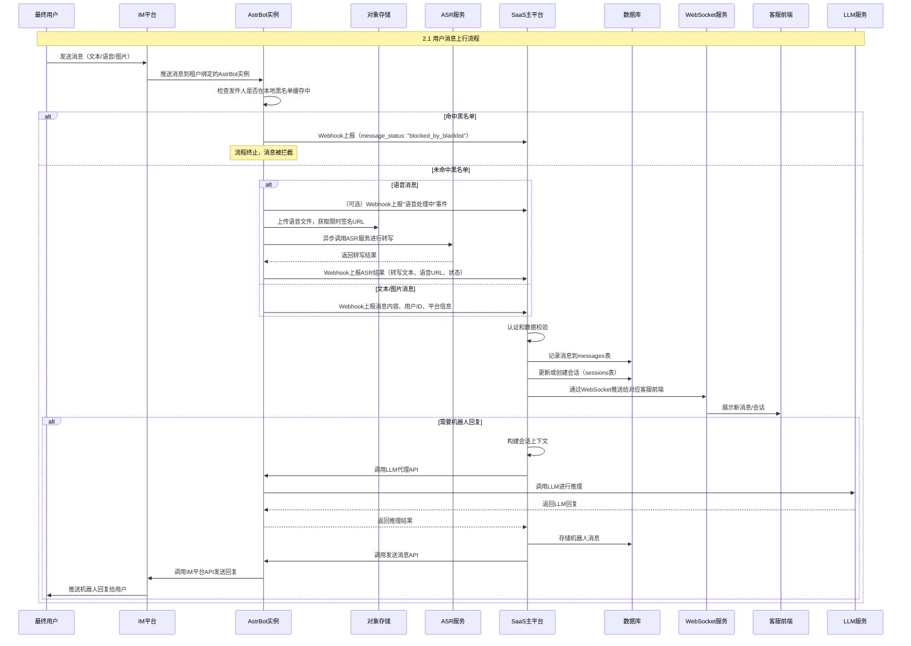
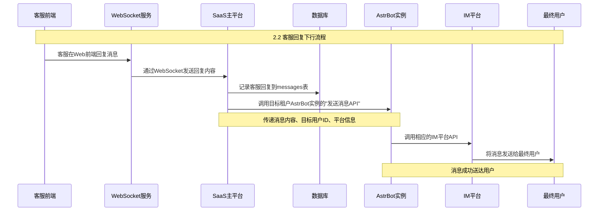
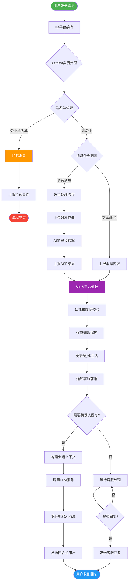

# 运行逻辑（核心流程图）

## 📑 目录
- [2.1 用户消息上行流程](#21-用户消息上行流程)
- [2.2 客服回复下行流程](#22-客服回复下行流程)
- [可视化图表](#可视化图表)
  - [用户消息上行时序图](#用户消息上行时序图)
  - [客服回复下行时序图](#客服回复下行时序图)
  - [系统整体架构图](#系统整体架构图)
  - [消息处理生命周期图](#消息处理生命周期图)

---

## 2.1 用户消息上行流程
> **流程方向：** 最终用户 → IM平台 → AstrBot实例 → SaaS主平台 → 客服前端

### 🔄 详细流程步骤

#### 步骤1：消息发起
- **最终用户** 在IM平台发送消息（文本/语音/图片）

#### 步骤2：消息接收与预处理
- **IM平台** 将消息推送给与租户绑定的 **AstrBot实例**
- **AstrBot实例** 开始处理消息流程

#### 步骤3：安全检查
- 🛡️ **黑名单检查**：检查发件人是否在本地黑名单缓存中
  - ❌ **命中黑名单**：拦截消息，通过Webhook向SaaS主平台上报 `message_status: "blocked_by_blacklist"`，**流程终止**
  - ✅ **未命中黑名单**：继续处理流程

#### 步骤4：消息类型处理
##### 🎙️ 语音消息处理流程
1. **（可选）** 立即通过Webhook向SaaS主平台上报"语音处理中"事件
2. **语音文件上传**：将语音文件上传至对象存储，获取限时签名URL
3. **异步ASR转写**：异步调用ASR服务进行语音转文字
4. **结果上报**：ASR完成后，通过Webhook向SaaS主平台上报结果
   - 转写文本、原始语音URL、成功/失败状态

##### 📝 文本/图片消息处理
- 直接通过Webhook向SaaS主平台上报消息内容、用户ID、平台等信息

#### 步骤5：SaaS平台处理
1. **🔐 认证和数据校验**：验证Webhook请求的合法性
2. **💾 数据存储**：
   - 记录消息到数据库（`messages`表）
   - 更新或创建会话（`sessions`表）
3. **📡 实时推送**：根据会话分配逻辑，通过WebSocket推送给对应客服前端
4. **🤖 智能回复**（如果需要机器人回复）：
   - 构建会话上下文
   - 通过AstrBot实例的LLM代理API调用LLM进行推理
   - 获取LLM回复后，存储到数据库并下发给最终用户

#### 步骤6：前端展示
- **客服前端** 收到WebSocket通知，展示新消息/会话

---

## 2.2 客服回复下行流程
> **流程方向：** 客服前端 → SaaS主平台 → AstrBot实例 → IM平台 → 最终用户

### 🔄 详细流程步骤

#### 步骤1：客服发起回复
- **客服** 在SaaS Web前端回复消息

#### 步骤2：消息传输
- **客服前端** 通过WebSocket将回复内容发送给 **SaaS主平台**

#### 步骤3：SaaS平台处理
1. **💾 数据记录**：记录客服回复到数据库（`messages`表）
2. **📤 消息下发**：调用目标租户对应的AstrBot实例提供的**"发送消息API"**
   - 传递消息内容、目标用户ID、平台等信息

#### 步骤4：消息发送
- **AstrBot实例** 接收到发送指令，调用相应的**IM平台API**将消息发送给**最终用户**

---

## 可视化图表

### 用户消息上行时序图

### 客服回复下行时序图

### 系统整体架构图

```mermaid
flowchart TB
    subgraph "SaaS主平台"
        WebUI[Web管理后台]
        API[RESTful API Gateway]
        TenantService[租户管理服务]
        SessionService[会话消息管理服务]
        UserService[用户管理服务]
        PostgreSQL[(PostgreSQL数据库)]
        Redis[(Redis缓存)]
        LLMOrchestration[LLM编排服务]
        Integration[外部服务配置管理]
        Blacklist[黑名单管理服务]
        Analytics[数据统计分析服务]
        WebSocket[WebSocket服务]
        InstanceMgmt[实例调度配置服务]
    end

    subgraph "AstrBot实例集群"
        subgraph "租户A实例"
            AstrBot1[AstrBot实例1]
            IMAdapter1[IM平台适配器]
            WebhookReporter1[Webhook上报模块]
            APIReceiver1[消息下发API模块]
            ConfigSync1[配置接收应用模块]
            BlacklistCache1[本地黑名单缓存]
            ASRModule1[ASR执行模块]
            LLMProxy1[LLM推理代理API]
            VoiceHandler1[语音文件处理模块]
        end
        
        subgraph "租户N实例"
            AstrBotN[AstrBot实例N]
            IMAdapterN[IM平台适配器]
            WebhookReporterN[Webhook上报模块]
            APIReceiverN[消息下发API模块]
            ConfigSyncN[配置接收应用模块]
            BlacklistCacheN[本地黑名单缓存]
            ASRModuleN[ASR执行模块]
            LLMProxyN[LLM推理代理API]
            VoiceHandlerN[语音文件处理模块]
        end
    end

    subgraph "外部服务"
        WeChat[企业微信]
        QQ[QQ平台]
        Dify[Dify平台]
        ObjectStorage[对象存储]
        ASRService[ASR服务]
    end

    %% SaaS平台内部连接
    WebUI --> API
    API --> TenantService
    API --> SessionService
    API --> UserService
    API --> LLMOrchestration
    API --> Blacklist
    API --> Analytics
    API --> InstanceMgmt
    
    SessionService --> PostgreSQL
    UserService --> PostgreSQL
    TenantService --> PostgreSQL
    Analytics --> PostgreSQL
    
    SessionService --> Redis
    WebSocket --> Redis
    
    %% SaaS平台与AstrBot实例通信
    API -.->|HTTPS API调用<br/>配置下发/指令下发| AstrBot1
    API -.->|HTTPS API调用<br/>配置下发/指令下发| AstrBotN
    
    WebhookReporter1 -.->|Webhook HTTPS<br/>消息/事件上报| API
    WebhookReporterN -.->|Webhook HTTPS<br/>消息/事件上报| API
    
    %% AstrBot实例与外部服务
    IMAdapter1 <--> WeChat
    IMAdapter1 <--> QQ
    IMAdapterN <--> WeChat
    IMAdapterN <--> QQ
    
    LLMProxy1 <--> Dify
    LLMProxyN <--> Dify
    
    VoiceHandler1 --> ObjectStorage
    VoiceHandlerN --> ObjectStorage
    
    ASRModule1 --> ASRService
    ASRModuleN --> ASRService
    
    %% 数据流向
    WebSocket --> WebUI
    
    style SaaS主平台 fill:#e1f5fe
    style AstrBot实例集群 fill:#f3e5f5
    style 外部服务 fill:#e8f5e8
```

### 消息处理生命周期图

---

## 📋 关键要点总结

### 🔒 安全控制
- **黑名单机制**：AstrBot实例本地缓存，优先检查
- **认证验证**：SaaS平台Webhook请求验证
- **数据隔离**：多租户严格隔离

### ⚡ 性能优化
- **异步处理**：语音转文字异步执行
- **本地缓存**：黑名单本地缓存提升性能
- **WebSocket**：实时推送减少延迟

### 🔄 可靠性保障
- **幂等处理**：Webhook使用唯一ID防重
- **重试机制**：ASR失败自动重试
- **状态追踪**：完整的消息状态管理