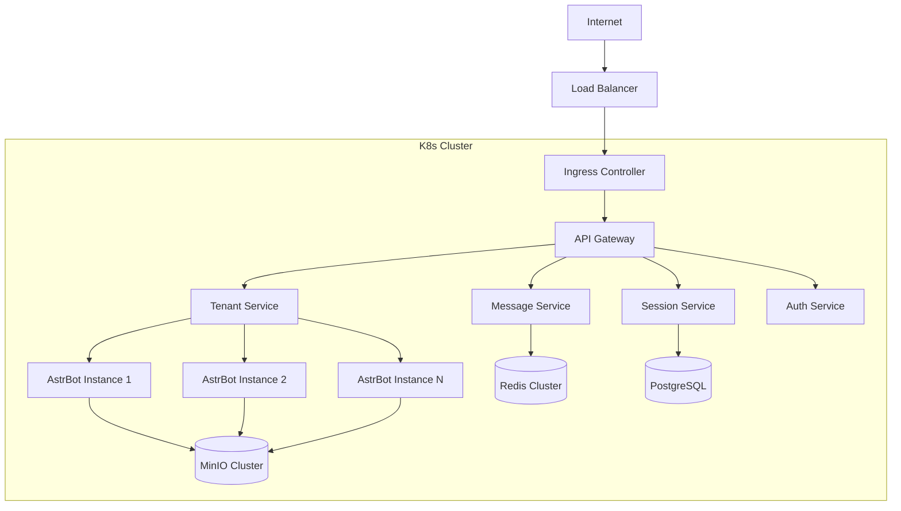
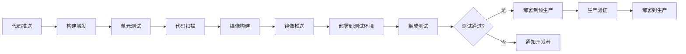

# 部署与运维文档

## 📑 目录
- [1. 部署架构设计](#1-部署架构设计)
- [2. 环境配置](#2-环境配置)
- [3. 部署流程](#3-部署流程)
- [4. 监控与告警](#4-监控与告警)
- [5. 日志管理](#5-日志管理)
- [6. 数据备份与灾备](#6-数据备份与灾备)
- [7. 版本升级与回滚](#7-版本升级与回滚)
- [8. 故障应急处理](#8-故障应急处理)
- [9. 性能优化](#9-性能优化)
- [10. 安全加固](#10-安全加固)

---

## 1. 部署架构设计

### 1.1 Kubernetes集群架构

#### 🏗️ 基础设施层
```
┌─────────────────────────────────────────────┐
│                K8s Master                  │
├─────────────────────────────────────────────┤
│         Control Plane Components          │
│  • API Server    • etcd     • Scheduler   │
│  • Controller Manager      • Cloud Manager │
└─────────────────────────────────────────────┘
              ↓ (Cluster Network)
┌─────────────────────────────────────────────┐
│                Worker Nodes                │
├─────────────┬─────────────┬─────────────────┤
│  Node 1     │   Node 2    │    Node N       │
│• kubelet    │ • kubelet   │  • kubelet      │
│• kube-proxy │ • kube-proxy│  • kube-proxy   │
│• Container  │ • Container │  • Container    │
│  Runtime    │   Runtime   │    Runtime      │
└─────────────┴─────────────┴─────────────────┘
```

#### 🔧 核心组件部署清单
| 组件类型 | 部署方式 | 实例数量 | 资源要求 |
|---------|----------|----------|----------|
| **API Gateway** | Deployment | 3 | 2C4G |
| **Tenant Service** | Deployment | 2 | 1C2G |
| **Session Service** | Deployment | 3 | 2C4G |
| **Message Service** | Deployment | 3 | 2C4G |
| **Auth Service** | Deployment | 2 | 1C2G |
| **AstrBot实例** | 动态Deployment | N | 1C2G/租户 |

### 1.2 网络架构设计

#### 🌐 网络拓扑图


#### 🔐 安全组策略
```yaml
# 网络安全策略示例
apiVersion: networking.k8s.io/v1
kind: NetworkPolicy
metadata:
  name: saas-platform-security
spec:
  podSelector:
    matchLabels:
      app: saas-platform
  policyTypes:
  - Ingress
  - Egress
  ingress:
  - from:
    - namespaceSelector:
        matchLabels:
          name: kube-system  # 允许来自系统命名空间
    - podSelector:
        matchLabels:
          app: api-gateway   # 允许来自API网关
  egress:
  - to:
    - podSelector:
        matchLabels:
          app: database      # 允许访问数据库
  - to:
    - podSelector:
        matchLabels:
          app: redis         # 允许访问Redis
```

---

## 2. 环境配置

### 2.1 多环境管理

#### 📋 环境配置矩阵
| 环境 | 目的 | 规模 | 数据源 | 监控级别 |
|------|------|------|--------|----------|
| **开发(dev)** | 日常开发测试 | 1节点 | 测试数据 | 基础监控 |
| **测试(test)** | 集成测试/QA | 2节点 | 仿真数据 | 完整监控 |
| **预生产(staging)** | 生产验证 | 3节点 | 脱敏生产数据 | 生产级监控 |
| **生产(prod)** | 正式环境 | 5+节点 | 真实数据 | 全面监控 |

#### ⚙️ ConfigMap配置管理
```yaml
# configmap-prod.yaml
apiVersion: v1
kind: ConfigMap
metadata:
  name: saas-platform-config
  namespace: production
data:
  # 数据库配置
  DB_HOST: "postgresql-cluster.prod.svc.cluster.local"
  DB_PORT: "5432"
  DB_NAME: "saas_platform"
  REDIS_HOST: "redis-cluster.prod.svc.cluster.local"
  REDIS_PORT: "6379"
  
  # 服务配置
  API_RATE_LIMIT: "1000"
  SESSION_TIMEOUT: "3600"
  MAX_ASTRBOT_INSTANCES: "1000"
  
  # 监控配置
  METRICS_ENABLED: "true"
  LOG_LEVEL: "INFO"
  TRACE_SAMPLING_RATE: "0.1"
```

#### 🔒 Secret敏感信息管理
```yaml
# secret-prod.yaml
apiVersion: v1
kind: Secret
metadata:
  name: saas-platform-secrets
  namespace: production
type: Opaque
data:
  # Base64编码的敏感信息
  DB_PASSWORD: <base64-encoded-password>
  REDIS_PASSWORD: <base64-encoded-password>
  JWT_SECRET: <base64-encoded-jwt-secret>
  LLM_API_KEY: <base64-encoded-api-key>
  MINIO_ACCESS_KEY: <base64-encoded-access-key>
  MINIO_SECRET_KEY: <base64-encoded-secret-key>
```

### 2.2 基础设施组件配置

#### 🗄️ PostgreSQL集群配置
```yaml
# postgresql-ha.yaml
apiVersion: postgresql.cnpg.io/v1
kind: Cluster
metadata:
  name: postgresql-cluster
spec:
  instances: 3
  
  postgresql:
    parameters:
      max_connections: "200"
      shared_buffers: "256MB"
      effective_cache_size: "1GB"
      maintenance_work_mem: "64MB"
      checkpoint_completion_target: "0.9"
      wal_buffers: "16MB"
      default_statistics_target: "100"
      random_page_cost: "1.1"
      effective_io_concurrency: "200"
  
  resources:
    requests:
      memory: "1Gi"
      cpu: "1"
    limits:
      memory: "2Gi"
      cpu: "2"
  
  storage:
    size: "100Gi"
    storageClass: "fast-ssd"
  
  monitoring:
    enabled: true
```

#### 📊 Redis集群配置
```yaml
# redis-cluster.yaml
apiVersion: redis.redis.opstreelabs.in/v1beta1
kind: RedisCluster
metadata:
  name: redis-cluster
spec:
  clusterSize: 6
  
  redisExporter:
    enabled: true
    image: "oliver006/redis_exporter:latest"
  
  storage:
    volumeClaimTemplate:
      spec:
        accessModes: ["ReadWriteOnce"]
        resources:
          requests:
            storage: "50Gi"
        storageClassName: "fast-ssd"
  
  resources:
    requests:
      cpu: "500m"
      memory: "1Gi"
    limits:
      cpu: "1"
      memory: "2Gi"
```

---

## 3. 部署流程

### 3.1 CI/CD流水线

#### 🔄 自动化部署流程


#### 📦 Docker镜像构建策略
```dockerfile
# Dockerfile.saas-platform
FROM python:3.11-slim as builder

# 安装依赖
WORKDIR /app
COPY requirements.txt .
RUN pip install --no-cache-dir -r requirements.txt

# 多阶段构建 - 生产镜像
FROM python:3.11-slim

# 创建非root用户
RUN groupadd -r appuser && useradd -r -g appuser appuser

# 复制应用代码
WORKDIR /app
COPY --from=builder /usr/local/lib/python3.11/site-packages /usr/local/lib/python3.11/site-packages
COPY --from=builder /usr/local/bin /usr/local/bin
COPY . .

# 设置权限
RUN chown -R appuser:appuser /app
USER appuser

# 健康检查
HEALTHCHECK --interval=30s --timeout=10s --start-period=5s --retries=3 \
  CMD curl -f http://localhost:8000/health || exit 1

EXPOSE 8000
CMD ["gunicorn", "--bind", "0.0.0.0:8000", "--workers", "4", "app.main:app"]
```

### 3.2 Helm Chart部署

#### 📊 Helm Chart结构
```
helm-charts/
├── saas-platform/
│   ├── Chart.yaml
│   ├── values.yaml
│   ├── values-dev.yaml
│   ├── values-staging.yaml
│   ├── values-prod.yaml
│   └── templates/
│       ├── deployment.yaml
│       ├── service.yaml
│       ├── ingress.yaml
│       ├── configmap.yaml
│       ├── secret.yaml
│       └── hpa.yaml
└── astrbot-instance/
    ├── Chart.yaml
    ├── values.yaml
    └── templates/
        ├── deployment.yaml
        ├── service.yaml
        └── configmap.yaml
```

#### ⚙️ 生产环境Helm Values
```yaml
# values-prod.yaml
replicaCount: 3

image:
  repository: saas-platform
  tag: "1.0.0"
  pullPolicy: IfNotPresent

service:
  type: ClusterIP
  port: 8000

ingress:
  enabled: true
  className: "nginx"
  annotations:
    cert-manager.io/cluster-issuer: "letsencrypt-prod"
    nginx.ingress.kubernetes.io/rate-limit: "1000"
  hosts:
    - host: api.saas-platform.com
      paths:
        - path: /
          pathType: Prefix
  tls:
    - secretName: saas-platform-tls
      hosts:
        - api.saas-platform.com

resources:
  limits:
    cpu: 2000m
    memory: 4Gi
  requests:
    cpu: 1000m
    memory: 2Gi

autoscaling:
  enabled: true
  minReplicas: 3
  maxReplicas: 10
  targetCPUUtilizationPercentage: 70
  targetMemoryUtilizationPercentage: 80

# 数据库配置
postgresql:
  enabled: false  # 使用外部PostgreSQL集群
  external:
    host: "postgresql-cluster.prod.svc.cluster.local"
    port: 5432
    database: "saas_platform"

redis:
  enabled: false  # 使用外部Redis集群
  external:
    host: "redis-cluster.prod.svc.cluster.local"
    port: 6379
```

### 3.3 零停机部署策略

#### 🔄 滚动更新配置
```yaml
# deployment.yaml
apiVersion: apps/v1
kind: Deployment
metadata:
  name: saas-platform
spec:
  strategy:
    type: RollingUpdate
    rollingUpdate:
      maxSurge: 50%        # 最多可以多创建50%的Pod
      maxUnavailable: 25%  # 最多可以有25%的Pod不可用
  
  template:
    spec:
      containers:
      - name: saas-platform
        livenessProbe:
          httpGet:
            path: /health
            port: 8000
          initialDelaySeconds: 30
          periodSeconds: 10
          timeoutSeconds: 5
          failureThreshold: 3
        
        readinessProbe:
          httpGet:
            path: /ready
            port: 8000
          initialDelaySeconds: 5
          periodSeconds: 5
          timeoutSeconds: 3
          failureThreshold: 3
        
        lifecycle:
          preStop:
            exec:
              command:
                - /bin/sh
                - -c
                - "sleep 15"  # 给正在处理的请求时间完成
```

---

## 4. 监控与告警

### 4.1 Prometheus监控配置

#### 📈 关键监控指标
```yaml
# prometheus-rules.yaml
groups:
- name: saas-platform-alerts
  rules:
  # API响应时间告警
  - alert: HighAPILatency
    expr: histogram_quantile(0.95, rate(http_request_duration_seconds_bucket[5m])) > 0.5
    for: 2m
    labels:
      severity: warning
    annotations:
      summary: "API响应时间过高"
      description: "95%的API请求响应时间超过500ms"
  
  # 错误率告警
  - alert: HighErrorRate
    expr: rate(http_requests_total{status=~"5.."}[5m]) / rate(http_requests_total[5m]) > 0.05
    for: 1m
    labels:
      severity: critical
    annotations:
      summary: "错误率过高"
      description: "5分钟内错误率超过5%"
  
  # 内存使用率告警
  - alert: HighMemoryUsage
    expr: container_memory_usage_bytes / container_spec_memory_limit_bytes > 0.9
    for: 5m
    labels:
      severity: warning
    annotations:
      summary: "内存使用率过高"
      description: "容器内存使用率超过90%"
  
  # AstrBot实例离线告警
  - alert: AstrBotInstanceDown
    expr: up{job="astrbot-instance"} == 0
    for: 1m
    labels:
      severity: critical
    annotations:
      summary: "AstrBot实例离线"
      description: "AstrBot实例 {{ $labels.instance }} 不可达"
```

#### 📊 Grafana仪表板配置
```json
{
  "dashboard": {
    "title": "SaaS平台监控大盘",
    "panels": [
      {
        "title": "API请求QPS",
        "type": "graph",
        "targets": [
          {
            "expr": "rate(http_requests_total[1m])",
            "legendFormat": "{{method}} {{endpoint}}"
          }
        ]
      },
      {
        "title": "响应时间分布",
        "type": "heatmap",
        "targets": [
          {
            "expr": "rate(http_request_duration_seconds_bucket[5m])",
            "format": "heatmap"
          }
        ]
      },
      {
        "title": "活跃租户数量",
        "type": "stat",
        "targets": [
          {
            "expr": "count(count by (tenant_id) (rate(http_requests_total{tenant_id!=\"\"}[5m])))"
          }
        ]
      },
      {
        "title": "AstrBot实例状态",
        "type": "table",
        "targets": [
          {
            "expr": "up{job=\"astrbot-instance\"}",
            "format": "table"
          }
        ]
      }
    ]
  }
}
```

### 4.2 告警通知配置

#### 🚨 AlertManager配置
```yaml
# alertmanager.yml
global:
  smtp_smarthost: 'smtp.gmail.com:587'
  smtp_from: 'alerts@saas-platform.com'

route:
  group_by: ['alertname', 'cluster', 'service']
  group_wait: 10s
  group_interval: 10s
  repeat_interval: 1h
  receiver: 'default'
  routes:
  - match:
      severity: critical
    receiver: 'critical-alerts'
  - match:
      alertname: AstrBotInstanceDown
    receiver: 'astrbot-alerts'

receivers:
- name: 'default'
  email_configs:
  - to: 'ops-team@saas-platform.com'
    subject: '{{ .GroupLabels.alertname }}'
    body: |
      {{ range .Alerts }}
      告警: {{ .Annotations.summary }}
      详情: {{ .Annotations.description }}
      时间: {{ .StartsAt }}
      {{ end }}

- name: 'critical-alerts'
  email_configs:
  - to: 'ops-team@saas-platform.com,cto@saas-platform.com'
    subject: '🚨 紧急告警: {{ .GroupLabels.alertname }}'
  slack_configs:
  - api_url: 'https://hooks.slack.com/services/...'
    channel: '#critical-alerts'
    title: '紧急告警'
    text: '{{ range .Alerts }}{{ .Annotations.summary }}{{ end }}'

- name: 'astrbot-alerts'
  webhook_configs:
  - url: 'http://astrbot-manager.saas-platform.svc.cluster.local/webhook/alert'
    send_resolved: true
```

---

## 5. 日志管理

### 5.1 ELK Stack部署

#### 📄 Fluentd日志收集配置
```yaml
# fluentd-configmap.yaml
apiVersion: v1
kind: ConfigMap
metadata:
  name: fluentd-config
data:
  fluent.conf: |
    <source>
      @type tail
      path /var/log/containers/*.log
      pos_file /var/log/fluentd-containers.log.pos
      tag kubernetes.*
      format json
      read_from_head true
    </source>
    
    <filter kubernetes.**>
      @type kubernetes_metadata
    </filter>
    
    # 过滤和解析SaaS平台日志
    <filter kubernetes.var.log.containers.**saas-platform**.log>
      @type parser
      key_name log
      <parse>
        @type json
        time_key timestamp
        time_format %Y-%m-%d %H:%M:%S
      </parse>
    </filter>
    
    # 添加环境标签
    <filter kubernetes.**>
      @type record_transformer
      <record>
        environment "#{ENV['ENVIRONMENT']}"
        cluster "#{ENV['CLUSTER_NAME']}"
      </record>
    </filter>
    
    <match kubernetes.**>
      @type elasticsearch
      host elasticsearch.logging.svc.cluster.local
      port 9200
      index_name k8s-logs
      type_name _doc
      include_tag_key true
      tag_key @log_name
      flush_interval 1s
    </match>
```

### 5.2 结构化日志规范

#### 📋 应用日志格式
```python
# 应用日志配置示例
import structlog
import logging

# 配置结构化日志
structlog.configure(
    processors=[
        structlog.stdlib.filter_by_level,
        structlog.stdlib.add_logger_name,
        structlog.stdlib.add_log_level,
        structlog.stdlib.PositionalArgumentsFormatter(),
        structlog.processors.TimeStamper(fmt="iso"),
        structlog.processors.StackInfoRenderer(),
        structlog.processors.format_exc_info,
        structlog.processors.UnicodeDecoder(),
        structlog.processors.JSONRenderer()
    ],
    context_class=dict,
    logger_factory=structlog.stdlib.LoggerFactory(),
    wrapper_class=structlog.stdlib.BoundLogger,
    cache_logger_on_first_use=True,
)

# 使用示例
logger = structlog.get_logger()

# 业务日志
logger.info(
    "message_created",
    tenant_id="tenant_123",
    user_id="user_456",
    session_id="session_789",
    message_id="msg_abc",
    content_length=100,
    processing_time_ms=45
)

# 错误日志
logger.error(
    "database_connection_failed",
    tenant_id="tenant_123",
    error_code="DB_CONN_TIMEOUT",
    retry_count=3,
    database_host="postgresql-cluster.prod",
    exc_info=True
)
```

---

## 6. 数据备份与灾备

### 6.1 数据库备份策略

#### 💾 PostgreSQL备份配置
```yaml
# postgresql-backup-cronjob.yaml
apiVersion: batch/v1
kind: CronJob
metadata:
  name: postgresql-backup
spec:
  schedule: "0 2 * * *"  # 每天凌晨2点执行
  jobTemplate:
    spec:
      template:
        spec:
          containers:
          - name: postgres-backup
            image: postgres:13
            command:
            - /bin/bash
            - -c
            - |
              # 全量备份
              pg_dump -h $DB_HOST -U $DB_USER -d $DB_NAME | gzip > /backup/$(date +%Y%m%d_%H%M%S)_full.sql.gz
              
              # 清理7天前的备份
              find /backup -name "*.sql.gz" -mtime +7 -delete
              
              # 上传到对象存储
              aws s3 cp /backup/ s3://saas-platform-backups/postgresql/ --recursive --exclude "*" --include "$(date +%Y%m%d)*"
            env:
            - name: DB_HOST
              value: "postgresql-cluster.prod.svc.cluster.local"
            - name: DB_USER
              valueFrom:
                secretKeyRef:
                  name: postgresql-secret
                  key: username
            - name: PGPASSWORD
              valueFrom:
                secretKeyRef:
                  name: postgresql-secret
                  key: password
            volumeMounts:
            - name: backup-storage
              mountPath: /backup
          volumes:
          - name: backup-storage
            persistentVolumeClaim:
              claimName: backup-pvc
          restartPolicy: OnFailure
```

### 6.2 灾难恢复计划

#### 🔄 RTO/RPO目标
| 服务类型 | RTO目标 | RPO目标 | 恢复策略 |
|---------|---------|---------|----------|
| **API服务** | < 5分钟 | 0 | 多AZ部署,自动故障转移 |
| **数据库** | < 30分钟 | < 15分钟 | 主从复制,快速切换 |
| **文件存储** | < 15分钟 | < 5分钟 | 跨区域复制 |
| **全系统** | < 2小时 | < 1小时 | 跨区域灾备 |

#### 🚨 灾难恢复流程
```bash
#!/bin/bash
# disaster-recovery.sh

# 1. 评估灾难影响
echo "=== 灾难恢复流程启动 ==="
echo "评估当前服务状态..."

# 检查主数据中心状态
kubectl --context=main-cluster get nodes
MAIN_CLUSTER_STATUS=$?

if [ $MAIN_CLUSTER_STATUS -ne 0 ]; then
    echo "主集群不可达，启动灾备切换..."
    
    # 2. 切换到灾备数据中心
    kubectl config use-context disaster-recovery-cluster
    
    # 3. 启动灾备服务
    echo "启动灾备环境服务..."
    helm upgrade --install saas-platform ./helm-charts/saas-platform \
        -f values-dr.yaml \
        --namespace production
    
    # 4. 数据库恢复
    echo "恢复数据库..."
    kubectl apply -f database-restore-job.yaml
    
    # 5. 更新DNS指向
    echo "更新DNS记录到灾备环境..."
    # 调用DNS API更新记录
    
    # 6. 验证服务可用性
    echo "验证服务恢复状态..."
    curl -f https://api.saas-platform.com/health
    
    echo "=== 灾难恢复完成 ==="
else
    echo "主集群正常，取消灾难恢复流程"
fi
```

---

## 7. 版本升级与回滚

### 7.1 蓝绿部署

#### 🔄 蓝绿切换流程
```bash
#!/bin/bash
# blue-green-deployment.sh

NEW_VERSION=$1
CURRENT_ENV=$(kubectl get service saas-platform-active -o jsonpath='{.spec.selector.version}')

echo "当前环境: $CURRENT_ENV"
echo "部署版本: $NEW_VERSION"

# 确定新环境颜色
if [ "$CURRENT_ENV" = "blue" ]; then
    NEW_ENV="green"
else
    NEW_ENV="blue"
fi

echo "部署到 $NEW_ENV 环境..."

# 1. 部署新版本到非活跃环境
helm upgrade --install saas-platform-$NEW_ENV ./helm-charts/saas-platform \
    --set image.tag=$NEW_VERSION \
    --set environment=$NEW_ENV \
    --namespace production

# 2. 等待新环境就绪
kubectl wait --for=condition=available --timeout=300s deployment/saas-platform-$NEW_ENV

# 3. 健康检查
echo "执行健康检查..."
NEW_ENV_POD=$(kubectl get pod -l app=saas-platform,environment=$NEW_ENV -o jsonpath='{.items[0].metadata.name}')
kubectl exec $NEW_ENV_POD -- curl -f http://localhost:8000/health

if [ $? -eq 0 ]; then
    # 4. 切换流量
    echo "切换流量到 $NEW_ENV 环境..."
    kubectl patch service saas-platform-active -p '{"spec":{"selector":{"environment":"'$NEW_ENV'"}}}'
    
    # 5. 验证切换成功
    sleep 10
    curl -f https://api.saas-platform.com/health
    
    if [ $? -eq 0 ]; then
        echo "部署成功，停止旧环境..."
        kubectl scale deployment saas-platform-$CURRENT_ENV --replicas=0
        echo "蓝绿部署完成"
    else
        echo "验证失败，回滚..."
        kubectl patch service saas-platform-active -p '{"spec":{"selector":{"environment":"'$CURRENT_ENV'"}}}'
    fi
else
    echo "健康检查失败，取消部署"
    kubectl delete deployment saas-platform-$NEW_ENV
fi
```

### 7.2 数据库迁移管理

#### 📊 Schema迁移脚本
```python
# database/migrations/001_add_tenant_table.py
"""
添加租户管理表
"""

def upgrade():
    """升级数据库Schema"""
    op.create_table(
        'tenants',
        sa.Column('id', sa.String(36), primary_key=True),
        sa.Column('name', sa.String(100), nullable=False),
        sa.Column('email', sa.String(255), nullable=False, unique=True),
        sa.Column('plan', sa.String(20), nullable=False),
        sa.Column('status', sa.String(20), nullable=False, default='active'),
        sa.Column('created_at', sa.DateTime, nullable=False, default=datetime.utcnow),
        sa.Column('updated_at', sa.DateTime, nullable=False, default=datetime.utcnow),
        sa.Index('idx_tenant_email', 'email'),
        sa.Index('idx_tenant_status', 'status')
    )

def downgrade():
    """回滚数据库Schema"""
    op.drop_table('tenants')
```

---

## 8. 故障应急处理

### 8.1 故障分类与处理流程

#### 🚨 故障等级定义
| 等级 | 影响范围 | 响应时间 | 处理策略 |
|------|----------|----------|----------|
| **P0 - 严重** | 全服务不可用 | 15分钟 | 立即处理,全员响应 |
| **P1 - 高** | 核心功能异常 | 30分钟 | 优先处理,技术负责人响应 |
| **P2 - 中** | 部分功能异常 | 2小时 | 正常处理,相关开发者响应 |
| **P3 - 低** | 性能影响 | 1天 | 计划处理,日常维护 |

#### 🔧 故障处理Runbook
```yaml
# runbooks/database-connection-failure.yaml
title: "数据库连接故障处理"
severity: "P1"
symptoms:
  - "API返回500错误"
  - "日志出现数据库连接超时"
  - "连接池耗尽告警"

investigation_steps:
  1. "检查数据库服务状态: kubectl get pods -l app=postgresql"
  2. "查看数据库连接数: SELECT count(*) FROM pg_stat_activity;"
  3. "检查慢查询: SELECT * FROM pg_stat_activity WHERE state = 'active' AND query_start < now() - interval '30 seconds';"
  4. "查看数据库日志: kubectl logs postgresql-0 -f"

resolution_steps:
  1. "重启应用Pod释放连接: kubectl rollout restart deployment/saas-platform"
  2. "如果数据库Pod异常，重启数据库: kubectl delete pod postgresql-0"
  3. "临时扩容数据库连接池: kubectl patch configmap app-config --patch '{\"data\":{\"DB_POOL_SIZE\":\"50\"}}'"
  4. "监控系统恢复状态"

escalation:
  - "15分钟内未解决，通知技术总监"
  - "30分钟内未解决，启动紧急会议"
```

### 8.2 自动故障恢复

#### 🤖 自愈脚本
```python
# scripts/auto-healing.py
import kubernetes
import time
import logging

class AutoHealer:
    def __init__(self):
        kubernetes.config.load_incluster_config()
        self.v1 = kubernetes.client.CoreV1Api()
        self.apps_v1 = kubernetes.client.AppsV1Api()
        
    def check_pod_health(self):
        """检查Pod健康状态并自动重启故障Pod"""
        pods = self.v1.list_namespaced_pod(
            namespace="production",
            label_selector="app=saas-platform"
        )
        
        for pod in pods.items:
            if self.is_pod_unhealthy(pod):
                logging.warning(f"发现故障Pod: {pod.metadata.name}")
                self.restart_pod(pod)
    
    def is_pod_unhealthy(self, pod):
        """判断Pod是否不健康"""
        # 检查重启次数
        restart_count = sum(
            container.restart_count for container in pod.status.container_statuses or []
        )
        if restart_count > 5:
            return True
            
        # 检查就绪状态
        for condition in pod.status.conditions or []:
            if condition.type == "Ready" and condition.status != "True":
                # 如果超过5分钟未就绪
                if time.time() - condition.last_transition_time.timestamp() > 300:
                    return True
        
        return False
    
    def restart_pod(self, pod):
        """重启故障Pod"""
        try:
            self.v1.delete_namespaced_pod(
                name=pod.metadata.name,
                namespace=pod.metadata.namespace
            )
            logging.info(f"已重启Pod: {pod.metadata.name}")
            
            # 发送告警通知
            self.send_alert(f"自动重启了故障Pod: {pod.metadata.name}")
            
        except Exception as e:
            logging.error(f"重启Pod失败: {e}")
    
    def send_alert(self, message):
        """发送告警通知"""
        # 集成告警系统API
        pass

if __name__ == "__main__":
    healer = AutoHealer()
    
    while True:
        try:
            healer.check_pod_health()
        except Exception as e:
            logging.error(f"自愈检查失败: {e}")
        
        time.sleep(60)  # 每分钟检查一次
```

---

## 📋 运维总结

### ✅ 运维核心要点
- **自动化优先**: 尽可能自动化重复性操作
- **监控驱动**: 基于监控数据进行运维决策
- **预防为主**: 通过监控和告警提前发现问题
- **快速恢复**: 建立完善的故障恢复机制

### ✅ 关键成功指标
- **可用性**: > 99.9% (月度)
- **MTTR**: < 30分钟 (平均故障恢复时间)
- **MTBF**: > 720小时 (平均故障间隔)
- **部署成功率**: > 95%

---

**运维文档版本**: v1.0  
**最后更新**: 2024年  
**下一步**: 运维工具集成和团队培训